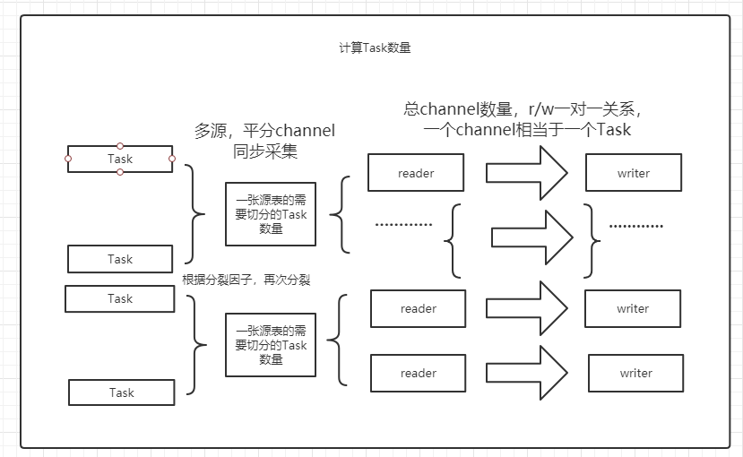

transformer自动注册代码：TransformerRegistry


```java
 /**
     * 这里比较复杂，分两步整合 1. tasks到channel 2. channel到taskGroup
     * 合起来考虑，其实就是把tasks整合到taskGroup中，需要满足计算出的channel数，同时不能多起channel
     * <p/>
     * example:
     * <p/>
     * 前提条件： 切分后是1024个分表，假设用户要求总速率是1000M/s，每个channel的速率的3M/s，
     * 每个taskGroup负责运行7个channel
     * <p/>
     * 计算： 总channel数为：1000M/s / 3M/s =
     * 333个，为平均分配，计算可知有308个每个channel有3个tasks，而有25个每个channel有4个tasks，
     * 需要的taskGroup数为：333 / 7 =
     * 47...4，也就是需要48个taskGroup，47个是每个负责7个channel，有4个负责1个channel
     * <p/>
     * 处理：我们先将这负责4个channel的taskGroup处理掉，逻辑是：
     * 先按平均为3个tasks找4个channel，设置taskGroupId为0，
     * 接下来就像发牌一样轮询分配task到剩下的包含平均channel数的taskGroup中
     */
```


## 组件


- Reader：Reader为数据采集模块，负责采集数据源的数据，将数据发送给Framework。
- Writer： Writer为数据写入模块，负责不断向Framework取数据，并将数据写入到目的端。
- Transformer：在数据同步、传输过程中，存在用户对于数据传输进行特殊定制化的需求场景，包括裁剪列、转换列等工作


- `Job`: `Job`是DataX用以描述从一个源头到一个目的端的同步作业，是DataX数据同步的最小业务单元。
- `Task`: `Task`是把`Job`拆分得到的最小执行单元。
- `JobContainer`: `Job`执行器，负责`Job`全局拆分、调度、前置语句和后置语句等工作的工作单元。
- `TaskGroupContainer`: `TaskGroup`执行器，负责执行一组`Task`的工作单元。
- `TaskGroup`: 描述的是一组`Task`集合。在同一个`TaskGroupContainer`执行下的`Task`集合称之为`TaskGroup`


## 参数

```shell
datax.py脚本接收参数
-j:jvm参数
--jobid: 在local与distribute模式下运行的作业唯一id
-m: 运行datax时的-Dmode参数，可选standalone, local, distribute 
-p: 运行datax时的额外的附加的运行参数
-r: 查看reader模板，与-w一起使用，${datax.home}/plugin/reader/${该读插件名称}/plugin_job_template.json
-w: 查看writer模板，与-r一起使用，${datax.home}/plugin/reader/${该写插件名称}/plugin_job_template.json

C:/dev/Python27/python.exe datax.py -p"-Dlast=123 -Dend=456" --jobid=123456 C:/Users/Lenovo/Desktop/datax/jobConf/mysql2mysql.json

#分配了启动 限制堆大小为1g，不可扩展，发生了 内存溢出错误dump路径为C:\Users\Lenovo\PycharmProjects/log 
java -server 
-Xms1g -Xmx1g -XX:+HeapDumpOnOutOfMemoryError -XX:HeapDumpPath=C:\Users\Lenovo\PycharmProjects/log 
-Dloglevel=info -Dfile.encoding=UTF-8 
-Dlogback.statusListenerClass=ch.qos.logback.core.status.NopStatusListener 
-Djava.security.egd=file:///dev/urandom 
-Ddatax.home=C:\Users\Lenovo\PycharmProjects 
-Dlogback.configurationFile=C:\Users\Lenovo\PycharmProjects/conf/logback.xml 
-classpath C:\Users\Lenovo\PycharmProjects/lib/*  
-Dlog.file.name=onf\mysql2mysql_json 
-Dlast=123 -Dend=456 com.alibaba.datax.core.Engine 
-mode standalone -jobid 123456 -job C:\Users\Lenovo\Desktop\datax\jobConf\mysql2mysql.json
#默认以standalone模式启动
datax.home=当前运行目录
logback.configurationFile=${data.home}/conf/logback.xml 
classpath=${datax.home}/lib/*

java -server \
-Xms1g -Xmx1g -XX:+HeapDumpOnOutOfMemoryError -XX:HeapDumpPath=/bmdata/software/bm_engine1_dx_1.0.2/log \
-Dloglevel=info -Dfile.encoding=UTF-8 \
-Dlogback.statusListenerClass=ch.qos.logback.core.status.NopStatusListener \
-Djava.security.egd=file:///dev/urandom \
-Ddatax.home=/bmdata/software/bm_engine1_dx_1.0.2/datax \
-Dlogback.configurationFile=/bmdata/software/bm_engine1_dx_1.0.2/datax/conf/logback.xml \
-classpath /bmdata/software/bm_engine1_dx_1.0.2/datax/lib/*:. \
com.alibaba.datax.core.Engine \
-mode standalone -jobid 123456 -job /bmdata/software/bm_engine1_dx_1.0.2/config/mft.json


```


CoreConstant中会提取datax.home这个环境变量供全局使用，拼接成core.json，plugin.json的地址


- 一些环境变量
- mode：standalone, local, distribute 选择作业运行模式
- jobid：在local与distribute模式下运行的作业唯一id
- job：作业配置文件路径
- classpath


- `Standalone`: 单进程运行，没有外部依赖。
- `Local`: 单进程运行，统计信息、错误信息汇报到集中存储。
- `Distrubuted`: 分布式多进程运行，依赖`DataX Service`服务。


## 运行流程


### 作业配置加载

- 通过作业配置文件路径（-job参数）来加载作业配置文件。

- CoreConstant通过环境变量获取core配置文件路径（datax.home拼接），加载core配置。

- 通过`job.content[0].reader/writer.name`读取该作业的插件名，通过`job.preHandler.pluginName`/`job.postHandler.pluginName`读取该作业的前置或后置处理插件名。通过CoreConstant获取以上所有读取到的插件名的绝对路径。

- 通过路径来加载插件配置文件内容。插件的配置文件按如下约束。

  ```json
  {
      "name": "mysqlwriter",
      "class": "com.alibaba.datax.plugin.writer.mysqlwriter.MysqlWriter",
      "description": "",
      "developer": ""
  }
  ```

  

- 在`Configuration.from(String json)`读取任意配置文件时都会将`${xxx}`或`$xxx`占位符替换成xxx对应的环境变量。即`-Dlast=123`使配置文件中 `${last}`替换成`123`， 该逻辑存在`StrUtil.replaceVariable(json)`中

- 将core，job，plugin配置合并，生成全局使用的配置`Configuration`。

  ```json
  {
      "entry":{……},
      "common":{……},
      "core":{
          "container":{
              "job":{
                  "id": ${jobId},
                  ………………其他配置
          	} 
      	}
      }，
      "job":{……},
  	"plugin":{
          "reader":{
              "${pluginName}":{
                  "name": "",
                  "class": "",
                  "description": "",
                  "developer": ""
              }
          },
          "writer":{
              "${pluginName}":{……}
          }
  	}
  }
  ```

- 最后做过滤输出和检查配置

### 引擎启动

- 从common取出需要的转换格式`yyyy-MM-dd`或编码`UTF-8`，用于String与Date或Bytes的互相转换
- 将配置`Configuration`传入`LoadUtil` Jar加载器，后面会使用LoadUtil进行插件Jar的动态加载。包括对每个插件的加载隔离机制和加载器缓冲的实现。
- 根据`core.container.model`判断使用`TaskGroupContainer`还是使用`JobContainer`，默认使用`JobContainer`
- PerfTrace初始化，默认不使用PerfTrace，获取`job.JobInfo ` 默认无该配置项，
- 容器启动


### JobContainer

其中加载操作中的加载插件时：

```
为避免jar冲突，比如hbase可能有多个版本的读写依赖jar包，JobContainer和TaskGroupContainer
就需要脱离当前classLoader去加载这些jar包，执行完成后，又退回到原来classLoader上继续执行接下来的代码

每个Jar的执行加载都有单一的类加载器进行隔离加载，JarLoader会缓冲到jarLoaderCenter中

LoadUtil.getJarLoader 就会根据插件类型和名字去jarLoaderCenter中获取加载器，获取不到之后才会重新构造一个加载器
```


- preHandle前置处理器：根据`job.preHandler.pluginName`加载已存在的插件，并执行插件的`preHandler`方法

- init初始化：

  1. 根据`job.content[0].reader/writer.name`插件名来加载reader和writer插件，并保存`reader/wirter PluginName`，

  2. 赋值`Configuration`，赋值`Job插件`本身和`对端插件`的配置`job.content[0].reader/writer.parameter`与对端的插件名子。并且执行他们的init方法。

     

- prepare准备：执行reader/writer的`prepare`方法

- split切分任务：

  1. 根据`job.setting.speed.byte`，`core.transport.channel.speed.byte`和`job.setting.speed.record`，`core.transport.channel.speed.record`的值计算出并发task数`needChannelNumber`，具体算法

     ```
     作业byte限速除于单个channel的byte限速 得到 byte限速下的所需channel
     作业record限速除于单个channel的record限速 得到record限速下的所需channel
     对比两个channel数取最小的作为needChannelNumber
     
     若job.setting.speed.byte与job.setting.speed.record设置为空
     则直接使用job.setting.speed.channel作为needChannelNumber
     若都为空，则抛出异常
     ```

     

  2. 执行reader和writer的`split`方法，获取经过`split`每个Task的reader和writer的配置。

     ```
     执行reader和writer最细粒度的切分，需要注意的是，writer的切分结果要参照reader的切分结果，
     达到切分后数目相等，才能满足1：1的通道模型，所以这里可以将reader和writer的配置整合到一起。
     
     计算出的needChannelNumber/tableNUm * 分裂因子 = 最终需要的Task数量
     ```

     

     在split方法中需要根据tables数量，splitPk进行分隔任务，每个任务下的connection都会根据切分结果与column，where来生成一个querySql。

  3. 获取作业的`transformer`配置，每个Task的reader和writer配置再加上该`transformer`的配置合并。将原本的`job.content`替换。即原本只有单个content，经过split后产生多个content，并为其设置递增的taskId

     ```json
     {
         "job": {
             "content": [
                 {
                     "taskId": 1,
                     "reader": {
                         "parameter": {
                             "querySql": ""
                         }
                     },
                     "transformer":[],
                     "writer": {}
                 },
                  {
                     "taskId": 2,
                     "reader": {},
                     "transformer":[],
                     "writer": {}
                 },
                 {
                     "taskId": 3,
                     "reader": {},
                     "transformer":[],
                     "writer": {}
                 }
             ],
             "setting": {
                 "speed": {
                     "channel": ""
                 }
          }
         }
     }
     ```
     
     

- schedule调度：

  1. `parseAndGetResourceMarkAndTaskIdMap`：以`reader.parameter.loadBalanceResourceMark`资源名做分组。得出一个 资源名称 --> taskId(List) 的 map 映射关系。在split阶段，会对插件的`loadBalanceResourceMark`进行设置，通常是使用jdbc连接的host

  2. doAssign：根据`parseAndGetResourceMarkAndTaskIdMap`的结果，将需要运行Task按一个特定的规则分配到taskGroup中。每个TaskGroup都将获得一份`Configuration`克隆，设置每个taskConfiguration的content中的`core.container.taskGroup.id`。并且修正`job.content`，使他的配置文件回到单content状态

     ```
     a 库上有表：0, 1, 2
     b 库上有表：3, 4
     c 库上有表：5, 6, 7
     
     如果有 4个 taskGroup
     打竖遍历添加到taskGroup 
     资源: 0 3 5|1 4 6| 2 7
     taskGroup: 0 3 5 1|4 6 2 7
     
     则 doAssign 后的结果为：
     taskGroup-0: 0,  4,
     taskGroup-1: 3,  6,
     taskGroup-2: 5,  2,
     taskGroup-3: 1,  7
     ```

     

  3. adjustChannelNumPerTaskGroup：修正因为无法平均分配的少一个task的taskGroup的`core.container.taskGroup.channel`的更改

     ```
     3个task分配到2个taskGroup中时，会造成一个taskGroup的channel为2,一个taskGroup的channel为1
     所以要将少了一个task的taskGroup的channel进行修正优化。
     ```

  4. 为每个taskGroup修正`core.container.job.mode`为standalone

  5. StandAloneScheduler#registerCommunication：为每个taskGroup注册Communication(状态及统计信息交互)

  6. StandAloneScheduler#startAllTaskGroup：为每个taskGroup创建`TaskGroupContainer`并代理到`TaskGroupContainerRunner`启动`TaskGroupContainer`。其中动态加载transfomer，数据采集就在这个步骤之内。

- post：执行reader和writer的`post`方法

- postHandle：根据`job.postHandler.pluginName`加载已存在的插件，并执行插件的`postHandler`方法

- invokeHooks：根据`/hook`目录调用外部hook

### TaskGroupContainer

类图


reader与writer的数据传输

