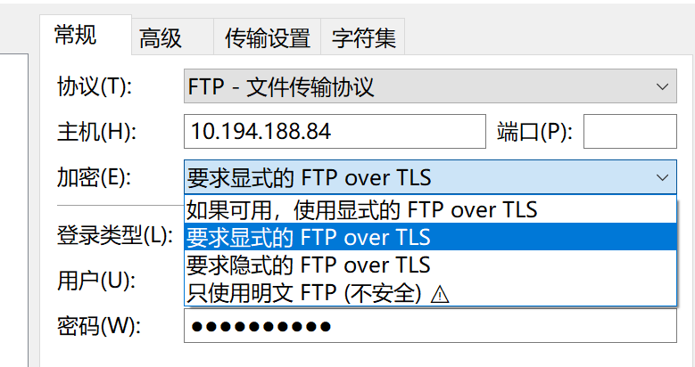

### 一、ftp配置over tls（使用ssl/tls）

#### 1. 创建签名证书

使用`openssl`生成自签名证书与rsa私钥

`openssl req -x509 -nodes -keyout /etc/vsftpd/vsftpd.key -out /etc/vsftpd/vsftpd.pem -days 365 -newkey rsa:2048`

除了Common Name需要填写服务器域名，其余可跳过

```bash
Generating a 2048 bit RSA private key
...........................+++
..............+++
writing new private key to '/etc/vsftpd/vsftpd.key'
-----
You are about to be asked to enter information that will be incorporated
into your certificate request.
What you are about to enter is what is called a Distinguished Name or a DN.
There are quite a few fields but you can leave some blank
For some fields there will be a default value,
If you enter '.', the field will be left blank.
-----
Country Name (2 letter code) [XX]:
State or Province Name (full name) []:
Locality Name (eg, city) [Default City]:
Organization Name (eg, company) [Default Company Ltd]:
Organizational Unit Name (eg, section) []:
Common Name (eg, your name or your server's hostname) []:localhost
Email Address []:
```


#### 2. 修改vsftpd.conf配置

复制以下配置，追加到`vsftpd.conf`中，并将`rsa_cert_file`与`rsa_private_key_file`填写刚刚生成证书与私钥对应的路径

```
ssl_enable=YES
ssl_sslv2=NO
ssl_sslv3=NO
ssl_tlsv1_2=YES
rsa_cert_file=/etc/vsftpd/vsftpd.pem
rsa_private_key_file=/etc/vsftpd/vsftpd.key
allow_anon_ssl=NO
force_local_data_ssl=YES
force_local_logins_ssl=YES
require_ssl_reuse=NO
ssl_ciphers=HIGH
```


#### 3. 重启ftp


### 二、代码修改

使用FTPSClient代替FTPClient，第二个参数决定是`隐式over tls`还是`显式over tls`。

```
this.ftpClient = new FTPSClient("SSL", true);
```

基于`FileZilla`中是否可连来选择隐式还是显式（默认启动ssl认证是显式）




遇到的问题，使用FTPSClient之后，无法获取任何的文件列表。

解决方案：执行以下三条配置，这明确告诉服务器不缓冲数据连接（ `PBSZ 0` ），并使用TLS保护数据传输（ `PROT P` ） 。

```
ftpClient.setFileType(FTP.BINARY_FILE_TYPE);
ftpClient.execPBSZ(0);
ftpClient.execPROT("P");
```

