## 编译spring boot 3 native + jpa 的 demo 实践

前提条件：已安装maven，笔者使用的是maven-3.5.4版本

### 一、Windows

#### 1、graalvm安装

[GraalVM22.3.0安装地址](https://github.com/graalvm/graalvm-ce-builds/releases/tag/vm-22.3.0)

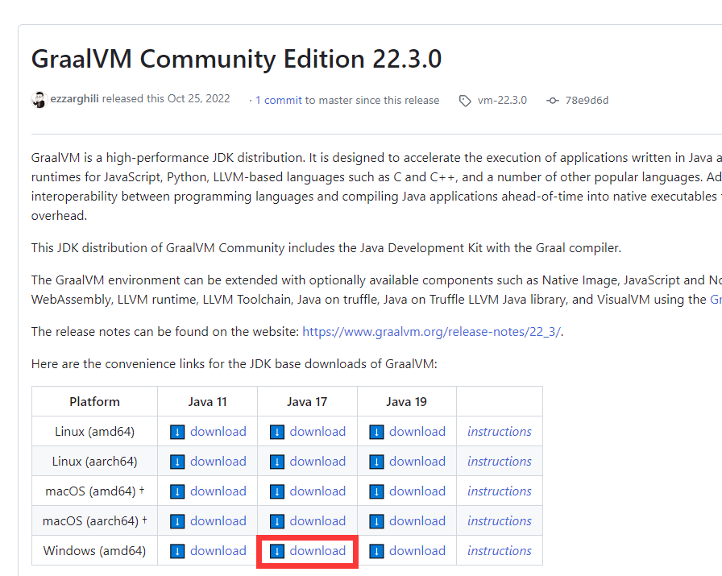

解压到任意目录后添加`JAVA_HOME`环境变量

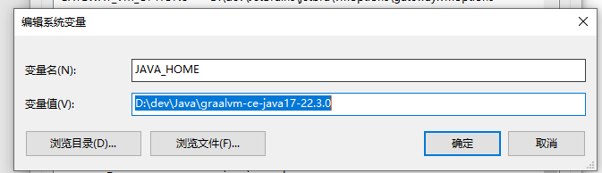

新增path：`%JAVA_HOME%与%JAVA_HOME%\bin`

安装成功：

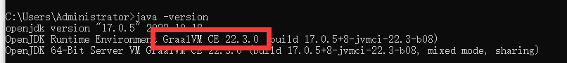


#### 2、安装VisualStudio

[安装VisualStudio](https://visualstudio.microsoft.com/zh-hans/?rr=https://www.microsoft.com/zh-cn/)

必须的选择：

1. MSVC v143 - VS 2022 c++ x64/x86生成工具 *根据你的jdk版本来选，jdk11需要MSVC v140 2015、jdk15需要MSVC v141 2017、jdk17需要MSVC v142 2019、jdk21需要MSVC v143 2022。当然他们向下兼容，如果你运行中出现了问题，尝试更换对应的版本。*
2. Windows 10 SDK *根据你的windows版本选择，如果说windows10就选择win10*


将cl.exe的目录添加到path中。该程序在笔者的`C:\Program Files\Microsoft Visual Studio\2022\Community\VC\Tools\MSVC\14.36.32532\bin\Hostx64\x86`下，请根据自己安装目录去寻找。

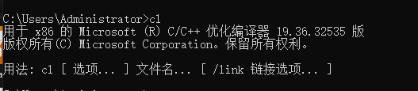


#### 3、安装native-image

使用`x64 Native Tools Command Prompt for VS 2022` 窗口来安装aot编译器native-image。

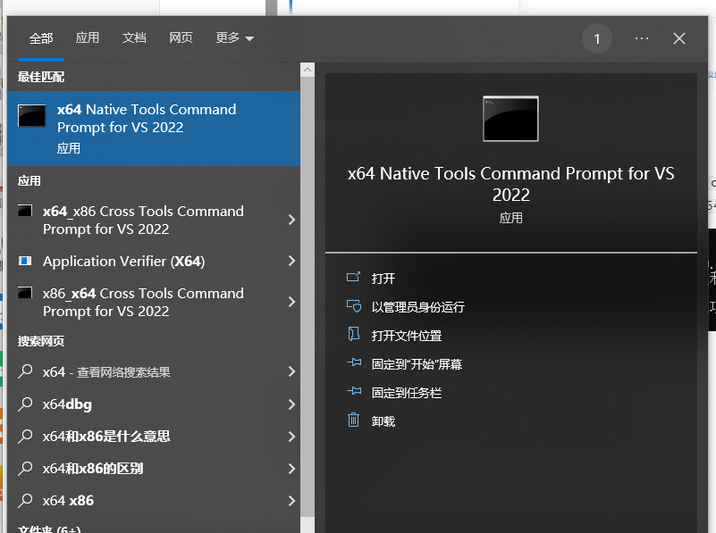


`gu install native-image`：该处我已经提前安装。

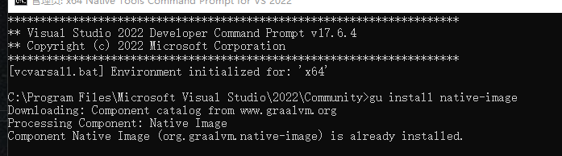


#### 4、下载spring boot3 native demo

[下载demo源码仓库地址spring-native-demo](https://github.com/wdragondragon/spring-native-demo.git)

其中demo中添加了spring-native插件。

```xml
<plugin>
    <groupId>org.graalvm.buildtools</groupId>
    <artifactId>native-maven-plugin</artifactId>
</plugin>
```

springboot3.0配置文件中已经添加了插件依赖，插件的作用就是编译java并且使用操作系统的可执行内核程序进行编译。

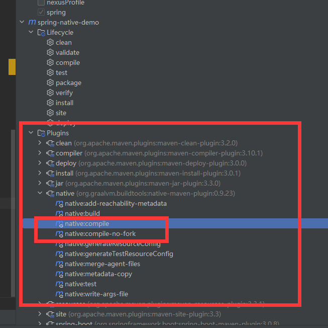


#### 5、编译可执行文件

据说在linux和mac中是可以直接使用该插件进行编译，但在windows中，需要使用 `x64 Native Tools Command Prompt for VS 2022` 窗口进行编译。


我们这里采用比较方便的方式进行 `x64 Native Tools Command Prompt for VS 2022` 窗口编译，该窗口实际上是使用`cmd`窗口执行以下目标指令，所以我们只需要在idea中设置`shell path`为`cmd+执行指令`就可以直接使用idea的`Terminal窗口`进行编译了。

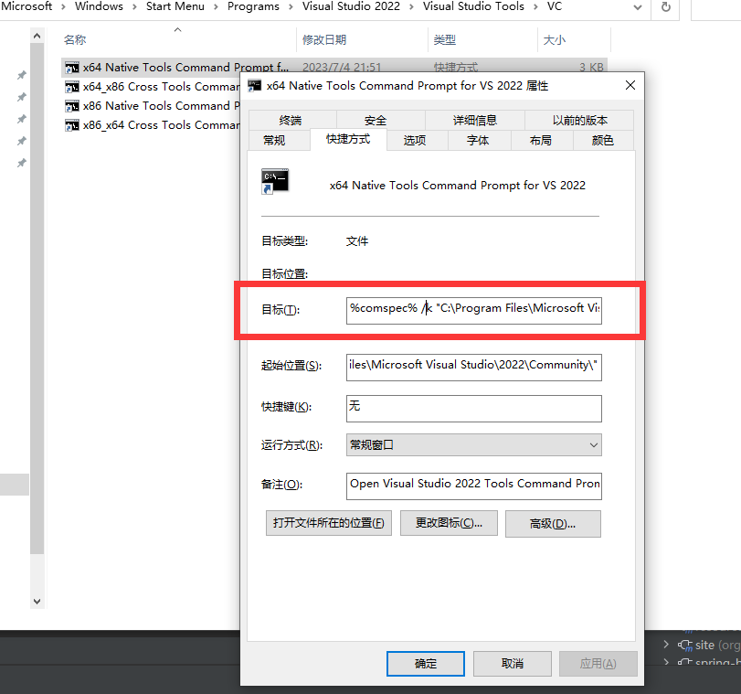


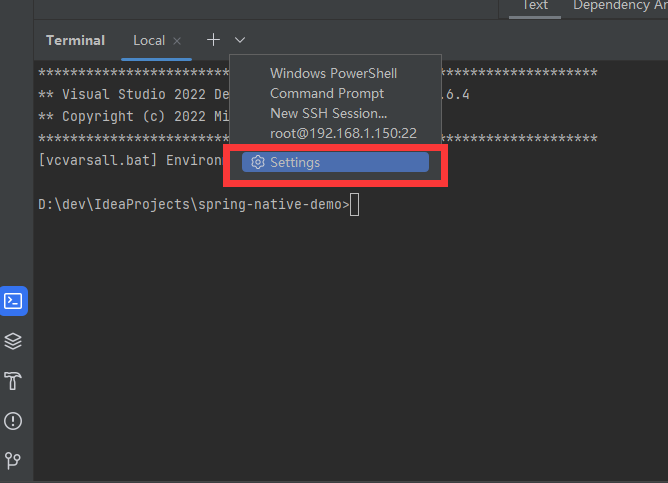


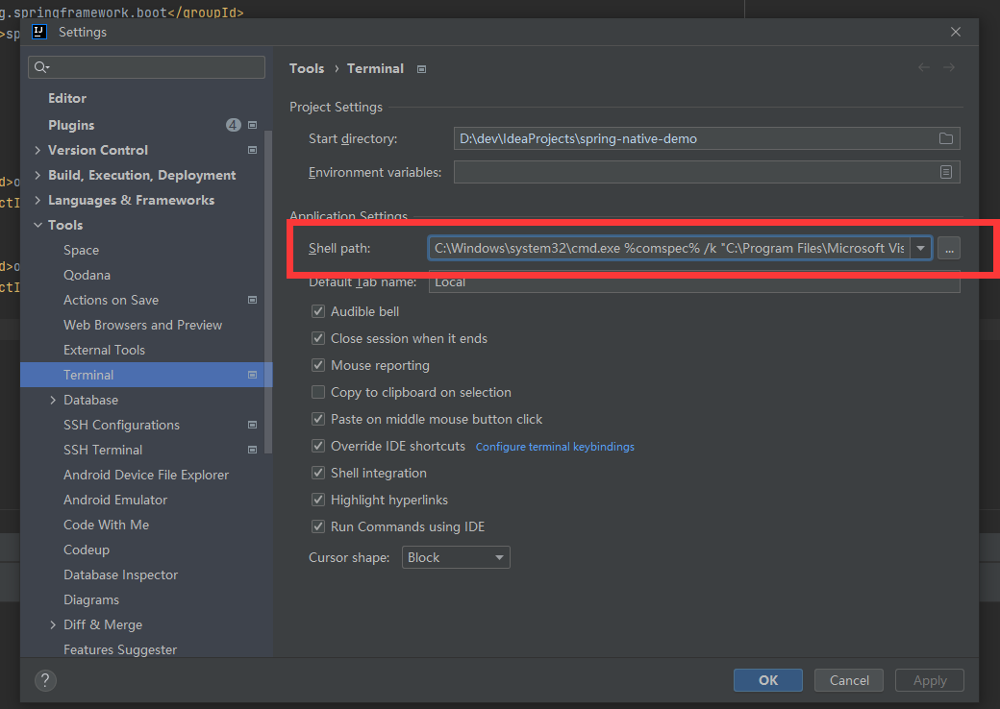


配置好后，Terminal中打印native窗口内容，就代表配置成功了。

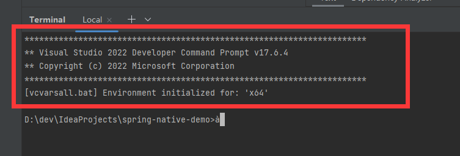


此时只需要我们执行编译指令`mvn install -Pnative native:compile -DskipTests=true`，等待后即可编译成功。会在target目录下生成exe可执行文件。

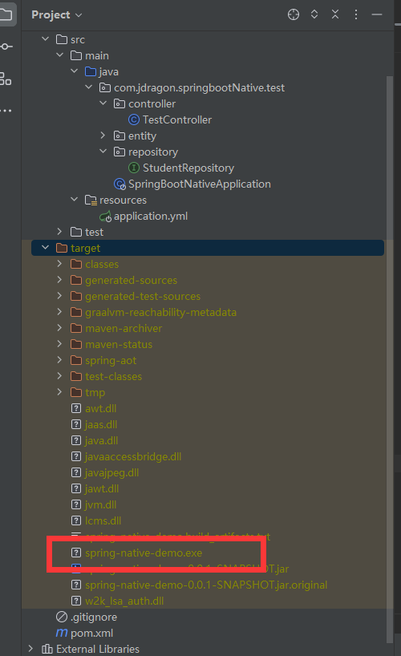

#### 6、执行可执行文件效果

执行exe文件。


在配置了`spring data jpa`mysql数据源的情况下，启动时间很乐观。

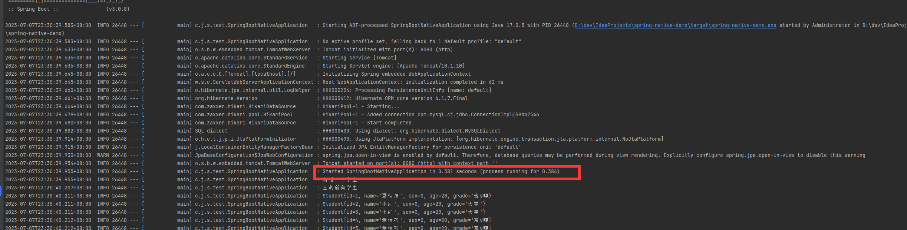

### 二、Linux

#### 1、graalvm安装

下载graalvm linux与native-image的安装jar。

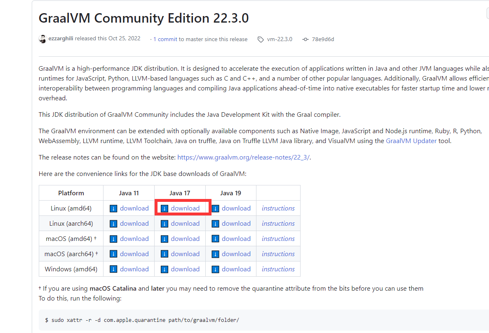

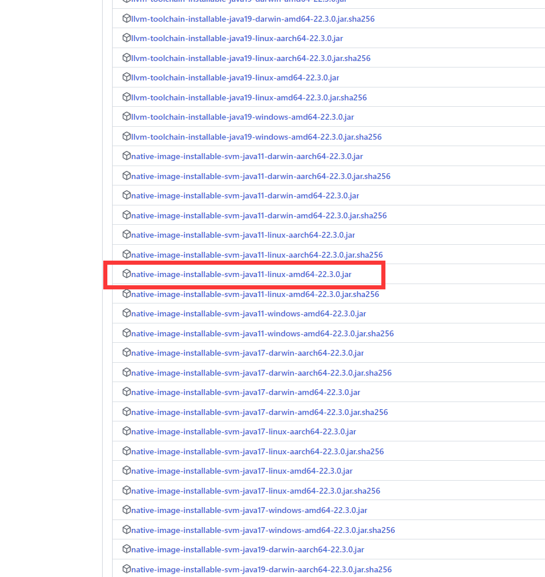

graalvm jdk解压后到任意目录后，将该目录添加到环境变量

`vim /etc/profile`

`source /etc/profile`


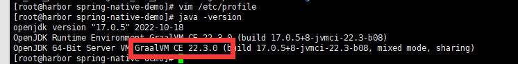


#### 2、安装gcc

`yum install -y gcc`

#### 3、安装native-image

使用刚下载的安装包安装native-image

`gu -L install native-image-installable-svm-java17-linux-amd64-22.3.0.jar`

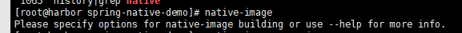


#### 4、克隆springboot3 native demo，编译可执行文件

```
git clone https://github.com/wdragondragon/spring-native-demo.git
cd spring-native-demo/
mvn install -Pnative native:compile -X -DskipTests=true
```

过程中可能会出现status 137的异常，该异常的出现是编译时内存不足导致oom，请在编辑`mvn`启动脚本，提高堆内存大小。

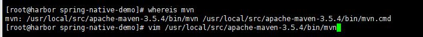

发现会使用环境变量`MAVEN_OPTS`来追加mvn启动的jvm参数。

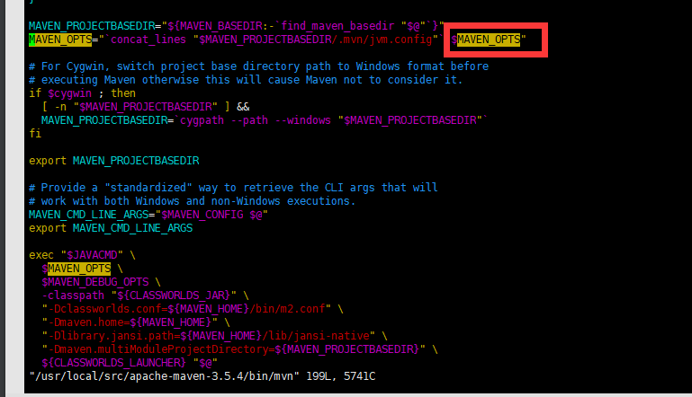

随后在`/etc/profile`添加以下内容，`source /etc/profile`后，再次执行编译。即可编译成功。

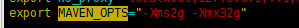

#### 5、执行可执行文件效果

编译成功后，`target/spring-native-demo`为可执行文件，启动可执行文件。配置了jpa的启动速度也十分乐观。

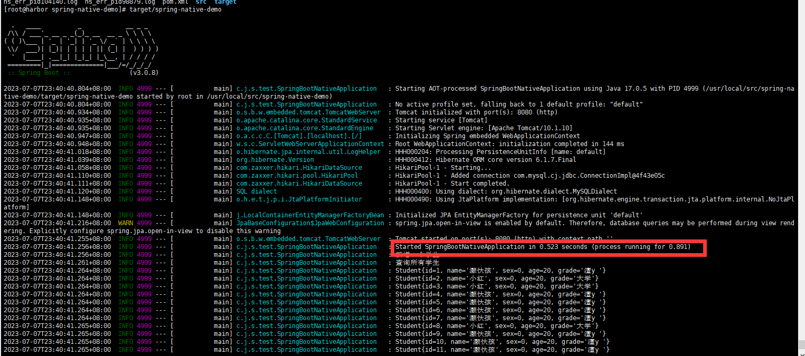


### 三、可能会出现的异常

​	在笔者编写该文章时，最新的springboot的ga版本已经是3.1.1了。有可能会有读者会将springboot的版本提升到最新。

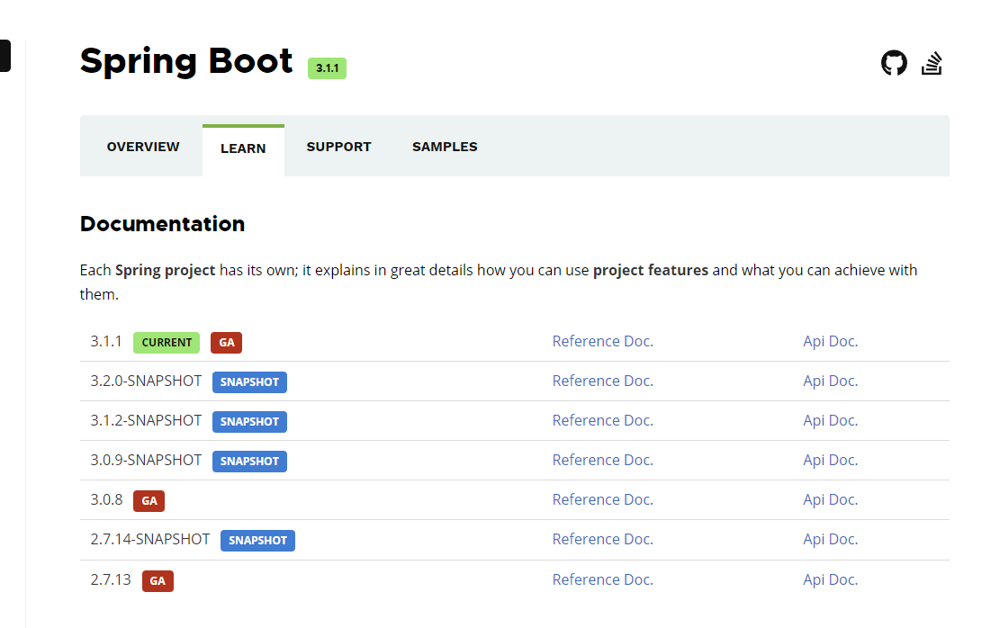


但在基于最新GA版本的springboot编译成可执行文件后，启动时会出现以下问题。会导致JpaRepository的interface method派生查询出现动态代理的异常。

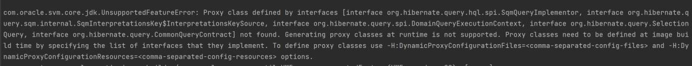


可以查看demo中的commit history，其中我尝试过使用`-H:DynamicProxyConfigurationFiles`指定`dynamic-proxy.json`来解决，也尝试过引入旧版springboot2.x中的`spring-native`来申明Hint。但都无济于事。最后在[graalvm-reachability-metadata这个子项目中的issue中](https://github.com/oracle/graalvm-reachability-metadata/issues/324)找到一些蛛丝马迹。

其中感谢`derkoe`的提醒，我将springboot的版本降低到了上一个GA版本3.0.8，然后再编译十分顺利了。


