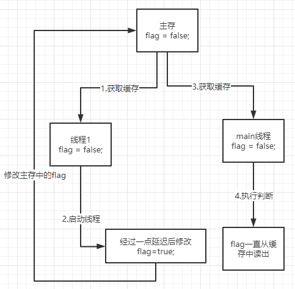
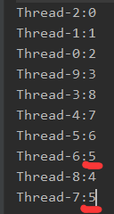
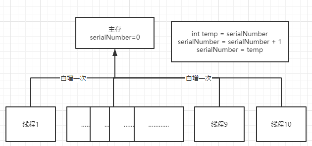
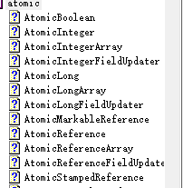
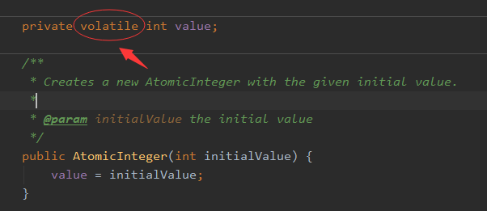
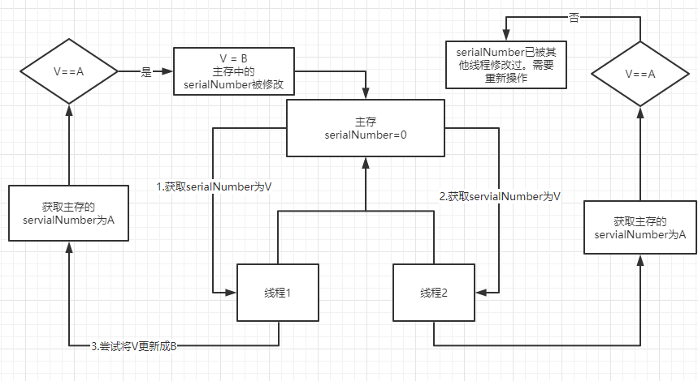
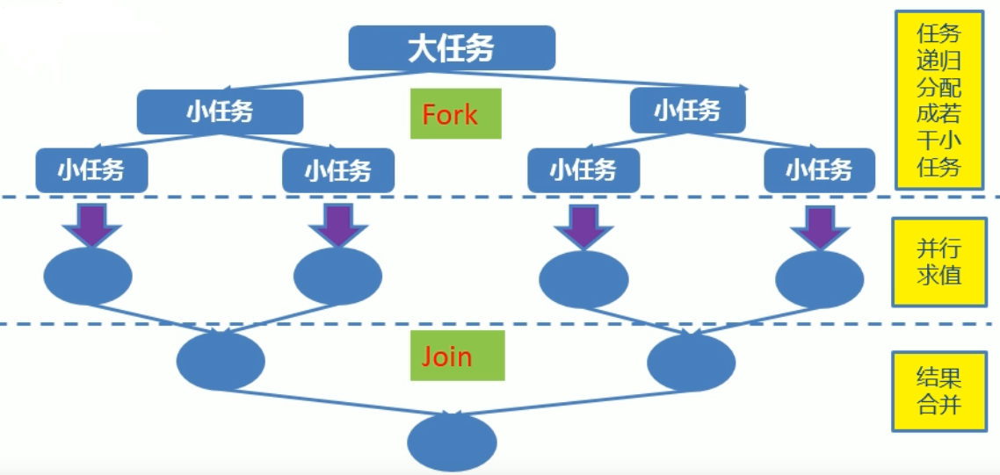

# JUC


## volatile关键字

- 不具备“互斥性”。
- 不能保证变量的“原子性”


**内存可见性问题：当多个线程操作共享数据时，彼此不可见**

先看如下代码，创建一个线程去运行ThreadDemo，在运行时更改flag的值为true，然后在main线程中读取flag的值，如果为true则输出。

```java
public class TestVolatile {
    public static void main(String[] args) {
        ThreadDemo td = new ThreadDemo();
        new Thread(td,"线程1").start();
        while (true){
            if(td.isFlag()){
                System.out.println("-------------------");
                break;
            }
        }
    }
}
class ThreadDemo implements Runnable{
    private boolean flag = false;
    @Override
    public void run() {
        try {
            Thread.sleep(200);
        } catch (InterruptedException ignored) {}
        flag = true;
        System.out.println("flag="+ isFlag());
    }
    public boolean isFlag() {
        return flag;
    }
}
```

然而输出结果只有一个`flag=true`，而`---------`并未被输出，这是为什么呢？


每个内存都分配一个缓存提高效率。




- 对共享数据进行改变时，先把主存的数据缓存到线程1中。
- 在线程1更改flag的值的时候，先在线程1中更改，再写到主存当中去。
- 但是在线程1写之前，main线程先把`flag=false`读到自己缓存中，这时候无论主存怎么更改，main线程中仍然认为flag值就是自己的缓存值。


**如何解决这个问题呢？**

- 使用同步锁`synchronized`能解决这个问题，但效率低下。
- 使用`volatile`关键：`private volatile boolean flag = false;`
  - 当多个线程进行操作共享数据时，可以保证内存中的数据是可见的。
  - 使用volatile时，每次操作都从主存中读写而不使用缓存。


## 原子变量和CAS算法

看以下代码：在main方法创建10个进程相同的进程并start，进程中的操作只有对进程代理的对象中的值进行自增一次。

```java
public class TestAtomicDemo {
    public static void main(String[] args) {
        AtomicDemo ad = new AtomicDemo();
        for (int i = 0; i < 10; i++) {
            new Thread(ad).start();
        }
    }
}

class AtomicDemo implements Runnable{

    private volatile int serialNumber = 0;

    @Override
    public void run() {
        try {
            Thread.sleep(100);
        } catch (InterruptedException ignored) {}
        System.out.println(Thread.currentThread().getName()+":"+getSerialNumber());
    }

    public int getSerialNumber() {
        return serialNumber++;
    }
}
```

我们理想中的输出，应该是，输出线程名称后显示每次递增的数字，且这些数字没有重复。


但输出的是，可见的是有数字重复，这代表着我们使用的volatile，这并不是线程安全的。



**这是因为，自增操作本质上不符合原子性：**

```java
int = 10;
i = i++;
//这其中的i = i++ 其实相当于
int temp = i;
i = i + 1;
i = temp;
```

看下图，我们虽然是直接对主存进行操作刷新的，但是线程1中temp获取到了serialNumber后还没有完成serialNumber=temp的赋值操作之前，线程2就已经将serialNumber赋值给了temp，这就导致了线程不安全。



**如何解决这个问题：**

- 使用java.util.concurrent.atomic包下提供的原子变量。



在之前代码中更改为使用原子变量

```java
private volatile int serialNumber = 0;
//替换成
private AtomicInteger serialNumber = new AtomicInteger(0);
//////////
return serialNumber++;
//替换成
return serialNumber.getAndIncrement();

```


**原子变量是如何解决这个问题的：**

- 使用了volatile关键字使变量内存可见。



- 使用了**CAS算法**，对某些特定非原子操作赋予原子性质。


**什么是CAS算法：**

- CAS算法是硬件对于并发操作共享数据的支持。

- CAS包含了三个操作数：内存值V、预估值A、更新值B

- 当且V == A时，V更新成B，否则，将不做任何操作。


在线程1中执行自增，会到主存中获取V值，在更新前会将内存中的值再获取一次为A，如果V==A就会将V更新成B。若在获取V时。

如果在步骤1之后，修改完成之前，线程2也获取了servialNumber，并在修改servialNumber的值之前线程1修改完毕，这时候V就不==A。就会被判定为失效操作，需要再做循环。



**CAS算法的缺点**

- CPU开销较大
   在并发量比较高的情况下，如果许多线程反复尝试更新某一个变量，却又一直更新不成功，循环往复，会给CPU带来很大的压力。

- 不能保证代码块的原子性
   CAS机制所保证的只是一个变量的原子性操作，而不能保证整个代码块的原子性。比如需要保证3个变量共同进行原子性的更新，就不得不使用Synchronized了。


**模拟CAS算法**

```java
public class TestCAS {
    public static void main(String[] args) {
        final CompareAndSwap cas = new CompareAndSwap();
        for (int i = 0; i < 10; i++) {
            new Thread(() -> {
                //取出预估内存值
                int expectedValue = cas.get();
                boolean b = cas.compareAndSet(expectedValue, (int) (Math.random() * 101));
                System.out.println(b);
            }).start();
        }
    }
}

class CompareAndSwap{
    private int value;
    public synchronized int get(){
        return value;
    }
    public synchronized int compareAndSwap(int expectedValue,int newValue){
        //取出内存旧值
        int oldValue = value;
        //旧值与之前取出的预估值对比，相同才赋值
        if(oldValue == expectedValue){
            this.value = newValue;
        }
        return oldValue;
    }
    public synchronized boolean compareAndSet(int expectedValue,int newValue){
        return expectedValue == compareAndSwap(expectedValue,newValue);
    }
}
//true false true false false false true false true true 
```


## Concurrent集合

HashMap是线程不安全的，HashTable是线程安全的。底层基本相同，但操作有`synchronized`重量锁。

但Hashtable不仅效率低，且对复合操作，也是线程不安全的。


- JDK8前，ConcurrentHashMap采用“锁分段”机制。concurrentLevel默认16个段，每个段都为独立的锁。JDK8后，使用CAS算法。

- 当期望许多线程访问一个给定的collection时，ConcurrentHashMap通常优于同步的HashMap,ConcurrentSkipListMap通常优于同步的TreeMap。当期望的读数和遍历远远大于列表的更新数时CopyOnWriteArrayList优于同步的ArrayList。


CopyOnWriteArrayList在读的时候不设锁，在修改和添加时设锁，并复制一个新的List，将然后再加需要修改的index修改，然后再使原引用指向这个新的List。


## CounDownLatch 闭锁

闭锁的作用是可以使某个操作在多个线程操作后再进行。


```java
public class TestCountDownLatch {
    public static void main(String[] args) throws InterruptedException {
        final CountDownLatch latch = new CountDownLatch(5);
        LatchDemo ld = new LatchDemo(latch);
        long start = System.currentTimeMillis();
        for (int i = 0; i < 5; i++) {
            new Thread(ld).start();
        }
        latch.await();
        long end = System.currentTimeMillis();
        System.out.println("耗费时间为:" + (end - start));
    }
}

class LatchDemo implements Runnable {
    private final CountDownLatch latch;

    public LatchDemo(CountDownLatch latch) {
        this.latch = latch;
    }

    @Override
    public void run() {
        try{
            for (int i = 0; i < 50000; i++) {
                if (i % 2 == 0) {
                    System.out.println(i);
                }
            }
        }finally {
            synchronized (latch){
                latch.countDown();
            }
        }
    }
}
```

这里是计算五个线程并发时，运行所需时间。


在主线程中创建，闭锁设置锁值为5，在某个操作之前，进行闭锁的await，这时候，该线程会进入阻塞，直到这个闭锁的锁值变为0时，才能继续往下运行。


此时使用5个线程，其中线程操作完后就会将锁值减1，当5个线程做完后，就会输出运行所需时间。


## ReadWriteLock


读写锁中维护了读锁和写锁，允许多个读线程程读，写锁是独占的

```java
public class TestReadWriteLock {
    public static void main(String[] args) {
        ReadWriteLockDemo rw = new ReadWriteLockDemo();
        new Thread(() -> rw.set((int) (Math.random() * 101)), "Write:").start();
        for (int i = 0; i < 100; i++) {
            new Thread(rw::get, "Read:").start();
        }
    }
}

class ReadWriteLockDemo {

    private int number = 0;

    private ReadWriteLock lock = new ReentrantReadWriteLock();

    public void get() {
        lock.readLock().lock();
        try {
            System.out.println(Thread.currentThread().getName() + ":" + number);
        } finally {
            lock.readLock().unlock();
        }
    }

    public void set(int number) {
        lock.writeLock().lock();
        try {
            System.out.println(Thread.currentThread().getName() + number);
            this.number = number;
        } catch (Exception e) {
            e.printStackTrace();
        } finally {
            lock.writeLock().unlock();
        }
    }
}
```

## 线程八锁

线程八锁的关键：

- 非静态方法的锁默认为this，静态方法的锁为对应的Class实例
- 某一时刻内，只能有一个线程持有锁，无论几个方法

线程八锁：

1. 一个对象中有两个普通同步方法，启动两个线程，**互斥**
2. 情况1的基础上，在先运行的线程中有Thread.sleep，第二个方法会等待，**互斥**
3. 一同步方法，一个非同步方法，两种方法**不互斥**
4. 创建两个相同对象，对象中两个普通同步方法，启动两个线程，**不互斥**
5. 一个对象中有一个普通同步方法，一个静态同步方法，启动两个线程，**不互斥**
6. 一个对象中有两个静态同步方法，启动两个线程，**互斥**
7. 创建两个相同对象，对象中一个普通同步方法，一个静态同步方法，启动两个线程，**不互斥**
8. 创建两个相同对象，对象中两个静态同步方法，启动两个线程，**互斥**


## 线程池

- 线程池：提供一个线程队列，队列中保存着所有等待状态的线程。避免了创建与销毁额外开销，提供了响应速度

- 线程池的实现结构：

  ```
  java.util.concurrent.Executor：负责线程的使用与调度的根接口
       |--ExecutorService 子接口：线程池的主要接口
           |--ThreadPoolExecutor 实现类
           |--ScheduledExecutorService 子接口：负责线程调度
                |--ScheduledThreadPoolExecutor
  ```

  最后线程池创建的是ScheduledThreadPoolExecutor对象。继承了ThreadPoolExecutor 实现ScheduledExecutorService，所以具备线程池功能，也能做线程调度。

  

  在JDK8文档中，ThreadPoolExecutor的描述中显示：使用Executors中更方便的工厂方法来生成线程池。这里生成的线池池就是ScheduledThreadPoolExecutor对象。

- 工具类：Executors：

  - ExecutorService newCachedThreadPool():返回无限大小的线程池，可以根据需求自动的更改数量。
  - ExecutorService newFixedThreadPool():返回固定大小的线程池。
  - ExecutorService newSingleThreadExecutor():返回单例线程池。
  - ScheduledExecutorService newScheduledThreadPool():创建固定大小的线程池，可以延迟或定时的执行任务，属于线程调度工具。


**获取固定大小线程池的代码示例**

```java
public class TestThreadPool {
    public static void main(String[] args) throws ExecutionException, InterruptedException {
        //1.创建固定线程池
        ExecutorService pool = Executors.newFixedThreadPool(5);
        ThreadPoolDemo threadPoolDemo = new ThreadPoolDemo();
        //2.为线程池中的线程分配任务
        for (int i = 0; i < 10; i++) {
            pool.submit(threadPoolDemo);
        }
        //3.关闭线程池
        // shutdown所有任务完成前不再接受新任务，完成后再关闭，shutdownNow强制关闭
        pool.shutdown();
    }
}

class ThreadPoolDemo implements Runnable {
    private int i = 0;
    @Override
    public void run() {
        while (i <= 100) {
            System.out.println(Thread.currentThread().getName() + ":" + i++);
        }
    }
}
```


## ForkJoinPool

- Fork/Join框架：在必要的情况下，将一个大任务，进行拆分(fork)成若干个小任务(拆到不可再拆时)，再将一个个的小任务运算的结果进行join汇总。



- 采用“工作窃取”模式，当执行新的任务它可以将其拆分分成更小的任务执行，并将小任务加到线程队列中，然后栽倒从一个随机线程的队列中偷一个并把它放在自己的队列中。
- 相对于一般的线程池实现，fork/join框架的优势体现在对其中包含的任务的处理方式上，在一般的线程池中，如果一个线程正在执行的任务由于某些原因无法继续运行，那么该线程会处于等待状态。而在fork/join框架实现中，如果某个子问题由于等待另外一个子问题的完成而无法继续运行。那么处理该子问题的线程会主动寻找其他尚未运行的子问题来执行。这种方式减少了线程的等待时间，提高了性能。


从0累加到100亿，采用fork/join，类似二分查找，对小于设置的临界值时，设置fork分支任务，例：0到100亿的相加，可以分成0到50亿的累加，和50亿到100亿的累加。等拆到自己认为不可再拆时（自己设置临界值），就进行join合并结果。

```java
public class TestForkJoinPool {
    public static void main(String[] args) {
        ForkJoinPool pool = new ForkJoinPool();
        ForkJoinTask<Long> task =  new ForkJoinSumCalculate(0L,10000000000L);

        Instant start = Instant.now();

        Long sum = pool.invoke(task);

        Instant end = Instant.now();

        System.out.println(sum);

        System.out.println("耗时："+ Duration.between(start,end).toMillis());
    }
}
class ForkJoinSumCalculate extends RecursiveTask<Long> {

    private static final long serialVersionUID = -3837386534160506908L;

    private long start;

    private long end;

    private static final long THURSHOLD = 10000L;//临界值

    public ForkJoinSumCalculate(long start,long end){
        this.start = start;
        this.end = end;
    }

    @Override
    protected Long compute() {
        long length = end - start;
        if(length <= THURSHOLD){
            long sum = 0L;
            for (long i = start; i <= end; i++) {
                sum += i;
            }
            return sum;
        }else{
            long mid = (start+end)/2;
            ForkJoinSumCalculate left = new ForkJoinSumCalculate(start,mid);
            ForkJoinSumCalculate right = new ForkJoinSumCalculate(mid+1,end);
            left.fork();//进行拆分，同时压入线程队列
            right.fork();
            //结果合并
            return left.join()+right.join();
        }
    }
}
```


## aqs

### 独占模式请求锁acquire()


1. 尝试获取锁**tryAcquire**
   1. true => 继续运行
   2. false=>执行**addWaiter**，获取返回的node作为**acquireQueued**的参数执行
      1. **acquireQueued**(**addWaiter**())==true=>
      2. **acquireQueued**(**addWaiter**())==false=>


2. **addWaiter**

   1. 封装当前结点，判断tail是否为空
      1. true=>直接执行**enq**用自旋方式初始化队头head，并在下一次循环cas(tail,node)将tail设置为node，此时node在队尾
      2. false=>将tail的next设置为node，并执行**enq**()，cas(tail,node)，此时node在队尾。
   2. 返回node

3. **acquireQueued**

   1. failed = true; interrupted = false;
   2. 进入自旋循环
   3. 判断前驱是否为head
      1. true=>尝试获得锁**tryAcquire**
         1. true=>设置当前node为head，设置failed=false，**返回interrupted的值**
      2. false=>检查node是否需要阻塞**shouldParkAfterFailedAcquire**
         1. true=>执行**parkAndCheckInterrupt**()阻塞线程，并返回阻塞结果
         2. 阻塞结果后，设置interrupted = true

   

4. **shouldParkAfterFailedAcquire**
   1. 前驱结点状态为SIGNAL时，**返回true**，代表需要阻塞
   2. 前驱结点状态为CANCELLED时 ，说明要删除已被撤销的前驱结点，循环把CANCELLED状态的前驱结点全部删除。**返回false**。
   3. 前驱接点为0,CONDITION,PROPAGATE状态下时，需要被设置为SIGNAL，等待被唤醒。**返回false**。


### 独占模式释放锁release()


1. 尝试获取锁**tryAcquire**
   1. true=>判断线程队列头的状态，不为零则进入**unparkSuccessor**方法中断线程阻塞
   2. false=>锁释放失败
2. 返回true，锁释放成功


1. **unparkSuccessor**
   1. 头结点的waitStatus小于0（SIGNAL或CONDITION）时，用cas设置为0
   2. 寻找头结点的下一个结点Node s = head.next
      1. 该结点为空，则使用尾结点前驱查找需唤醒节点，然后赋给s
   3. 再次判断该结点s是否为空，不为空则中断阻塞。
   4. 在中断阻塞之后，其实就是继续运行**acquireQueued**中的**parkAndCheckInterrupt**的**Thread.interrupted**方法得到true，并将interrupted赋为true并且进入**acquireQueued**自旋的下一个循环时，会将头结点后移。抛弃原本的head。

