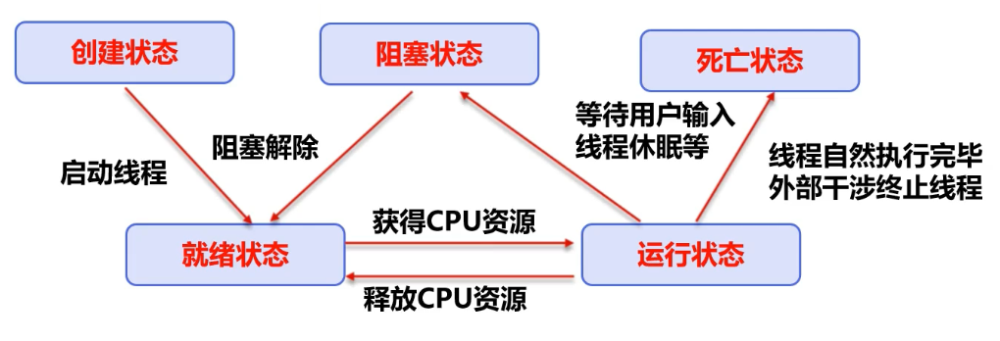
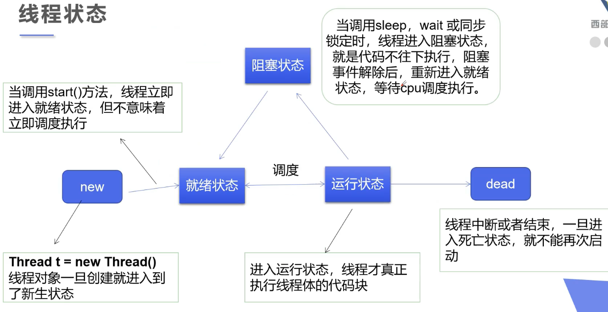
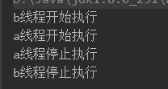

多线程

线程，进程，多线程


## 一、java线程


### 1. 线程状态








### 2. 线程方法

| 方法                           | 说明                                       |
| ------------------------------ | ------------------------------------------ |
| setPriority(int newPriority)   | 更改线程的优先级                           |
| static void sleep(long millis) | 在指定的毫秒数内让当前正在执行的线程休眠   |
| void join()                    | 等待该线程终止                             |
| static void yield()            | 暂停当前正在执行的线程对象，并执行其他线程 |
| void interrupt()               | 中断线程，避免使用这个方式                 |
| boolean isAlive()              | 测试线程是否处于活动状态                   |


## 二、线程操作

- **继承Thread类**
- **实现Runnable接口**
- 实现Callable接口

### 1. 线程的创建

#### 1）Thread

- 自定义线程类继承Thread类
- 重写run()方法，编写线程执行体
- 创建线程对象，调用start()方法启动线程

```java
public class TestThread1 extends Thread{
    @Override
    public void run() {
        for (int i = 0; i < 2000; i++) {
            System.out.println("我在看代码---"+i);
        }
    }
    public static void main(String[] args) {
        //创建一个线程对象并调用start()方法开启线程
        new TestThread1().start();

        for (int i = 0; i < 2000; i++) {
            System.out.println("我在学习多线程--"+i);
        }
    }
}
```

#### 2）Runnable

- 自定义线程类实现runnable接口
- 重写run()方法，编写线程执行体
- 使用自定义线程类为参数来构造一个Thread类，调用这个Thread类的start()方法启动线程
- 推荐使用，避免单继承局限性。

```java
public class TestThread3 implements Runnable {
    @Override
    public void run() {
        for (int i = 0; i < 2000; i++) {
            System.out.println("我在看代码---"+i);
        }
    }
    public static void main(String[] args) {
        //创建一个线程对象
        TestThread3 testThread3 = new TestThread3();
        //调用start()方法开启线程
        new Thread(testThread3).start();

        for (int i = 0; i < 2000; i++) {
            System.out.println("我在学习多线程--"+i);
        }
    }
}
```

#### 3）Callable

- 实现Callable接口，需要返回值类型
- 重写call方法，需要抛出异常
- 创建目标对象
- 创建执行服务：ExecutorService ser = Executors.newFixedThreadPool(1);
- 提交执行：Future<Boolean> result1 = ser.submit(t1);
- 获取结果：boolean r1 = result1.get()
- 关闭服务：ser.shutdownNow();

好处：可以返回结果，可以抛出异常


### 2. Thread中的静态代理


​	在使用Thread与Runnable实现创建线程时，都要进行`new Thread`操作，其实实质上，在Thread中也对Runnable接口进行了实现，Thread类的start()方法对Runnable接口的方法回调。在本质上Thread其实是一个Runnable实现类的代理类。


### 3. 线程停止(stop)

- 不推荐使用JDK提供的stop(),destroy()方法。
- 推荐线程自己停止下来
- 建议使用一个标志位进行终止变两颗，当flag=false，则终止线程运行。


```java
public class TestStop implements Runnable {
    // 1设置一个标志位
    private boolean flag = true;
    @Override
    public void run() {
        int i = 0;
        while (flag) {
            if (i > 900) {
                stop();
                System.out.println("线程停止");
            } else {
                System.out.println("run....Thread" + (i++));
            }
        }
    }
    // 2.设置一个公开的方法停止线成，转换标志位
    public void stop() {
        this.flag = false;
    }
    public static void main(String[] args) {
        TestStop testStop = new TestStop();
        new Thread(testStop).start();
    }
}
```


### 4. 线程休眠(sleep)

- sleep指定当前线程阻塞的毫秒数
- sleep存在异常InterruptedException
- sleep时间达到后线程进入就绪状态
- 每一个对象都有一个锁，sleep不会释放锁


```java
public static void tenDown() throws InterruptedException {
    int num = 10;
    while (true){
        Thread.sleep(1000);
        System.out.println(num--);
        if(num<=0){
            break;
        }
    }
}
```


### 5. 线程礼让(yield)

- 礼让线程，让当前正在执行的线程可，但不阻塞
- 让线程从运行状态转为就绪状态
- 让cpu重新调度，礼让不一定成功。属于重新就绪竞争

```java
public class TestYield {
    public static void main(String[] args) {
        MyYield myYield = new MyYield();
        new Thread(myYield,"a").start();
        new Thread(myYield,"b").start();
    }
}
class MyYield implements Runnable{
    @Override
    public void run() {
        System.out.println(Thread.currentThread().getName()+"线程开始执行");
        Thread.yield();
        System.out.println(Thread.currentThread().getName()+"线程停止执行");
    }
}
```

礼让成功



### 6. 线程强制执行(join)

- join合并线程，待此线程执行完成后，再执行其他线程，其他线程阻塞

```java
public class TestJoin implements Runnable {
    @Override
    public void run() {
        for (int i = 0; i < 1000; i++) {
            System.out.println("线程插队"+i);
        }
    }

    public static void main(String[] args) throws InterruptedException {
        TestJoin testJoin = new TestJoin();
        Thread thread = new Thread(testJoin);
        thread.start();

        //主线程
        for (int i = 0; i < 500; i++) {
            if(i==200){
                thread.join();
            }
            System.out.println("main"+i);
        }
    }
}
```

执行后，发现在main线程在200之前都是在交替执行，到200时main线程被强行插队，只能等待join线程执行完毕。


### 7. 线程状态观测(getState)

- NEW 尚未启动的线程处于此状态。 

- RUNNABLE在Java虚拟机中执行的线程处于此状态。 
- BLOCKED 被阻塞等待监视器锁定的线程处于此状态。 
- WAITING 正在等待另一个线程执行特定动作的线程处于此状态。 
- TIMED_WAITING 正在等待另一个线程执行动作达到指定等待时间的线程处于此状态。 
- TERMINATED 已退出的线程处于此状态。 

```java
public class TestState {
    public static void main(String[] args) throws InterruptedException {
        Thread thread = new Thread(()->{
            for (int i = 0; i < 5; i++) {
                try {
                    Thread.sleep(1000);
                } catch (InterruptedException e) {
                    e.printStackTrace();
                }
                System.out.println("/////");
            }
        });
        //观察新创建
        Thread.State state = thread.getState();
        System.out.println(state);
        //观察启动后
        thread.start();
        System.out.println(state = thread.getState());
        //观察直到结束
        while(state!=Thread.State.TERMINATED){
            Thread.sleep(100);
            System.out.println(state = thread.getState());
        }
    }
}
```

### 8. 优先级改变(priority)

优先级低只是意味着获得调度的概率低，并不是优先级低就不会被调用了。这都是看CPU的调度。

Thread中有关优先级的常量

- Thread.MIN_PRIORITY = 1;
- Thread.MAX_PRIORITY = 10;
- Thread.NORM_PRIORITY = 5;

### 9. 守护(daemom)线程

- 线程分为用户线程和守护线程
- 虚拟机必须确保用户线程执行完毕
- 虚拟机不用等待守护线程执行完毕
- 如，后台记录操作日志，监控内存，垃圾回收等待。

### 10. 线程同步

并发问题：同**一个对象**被**多个线程**同时操作，保证线程安全，要进行线程同步

线程同步其实就是一种**等待机制**，多个需要同时访问此对象的线程进入这个对象的等待池（队列）


**形成条件**：队列+锁

为了保证数据在方法中被访问时的正确性，在访问时加入**锁机制synchronized**，当一个线程获取对象的排它锁，独占资源，其他线程必须等待，使用后释放锁即可，但存在以下问题：

- 一个线程持有锁会导致其他所有需要此锁的线程挂起
- 在多线程竞争下，加锁，释放锁会导致比较多的上下文切换和调度延时，引起性能问题
- 如果一个优先级高的线程等待一个优先级低的线程释放锁，会导致优先级导致，引起性能问题。


#### 1）同步方法

- **使用private关键字来保证数据对象只能被方法访问。然后使用synchronized对访问方法修饰。**

#### 2）同步代码块

- 方法里面需要修改的内容才需要锁，锁的太多，浪费资源，所以存在**同步代码块**来代替**同步方法**。

- 同步块：`synchronized(Obj){}`对obj加锁。
  - Obj称之为**同步监视器**
  - Obj可以是任何对象，但是推荐使用共享资源作为同步监视器。
  - 同步方法中无需指定同步监视器，因为同步方法的同步监视器就是this,就是这个对象非，或者是class
- 同步监视器的执行过程
  - 第一个线程访问，锁定同步监视器，执行其中代码
  - 第二个线程访问，发现同步监视器被锁定，无法访问
  - 第一个线程访问完毕，解锁同步监视器
  - 第二个线程访问，发现同步监视器没有锁，然后锁定并访问

## 三、死锁

多个线程各自占有一些共享资源，并且互相等待其他线程占有的资源才能运行，而导致两个或多个线程都在等待对方释放资源，都停止执行的情形，某一个同步块同时拥有“两个以上对象的锁”时，就可能会发生“死锁”的问题。

**产生四锁的四个必要条件**

- 互斥条件：一个资源每次只能被一个进程使用
- 请求与保持条件：一个进程因请求资源而阻塞时，对已获得的资源保持不放。
- 不剥夺条件：进程已获得的资源，在未使用完之前，不能强行剥夺。
- 循环等待条件：若干进程之间形成一种头尾相接的循环等待资源关系。


## 四、Lock

- java.util.concurrent.locks.Lock接口是控制多个线程对共享资源进行访问的工具。

- ReentrantLock(可重入锁)实现了Lock，与synchronized相同的并发性和内存语义。

- 显式加锁，使用前创建ReentrantLock对象，在使用时进行lock()操作，使用完后释放锁unlock()

- 有异常的加锁，建议将解锁unlock写入finally中。

```java
public class TestLock {
    public static void main(String[] args) {
        TestLock2 testLock2 = new TestLock2();

        new Thread(testLock2,"1").start();
        new Thread(testLock2,"2").start();
        new Thread(testLock2,"3").start();
    }
}

class TestLock2  implements Runnable{

    int ticketNums = 10;

    private final ReentrantLock lock = new ReentrantLock();

    @Override
    public void run() {
        while (true){
            try {
                Thread.sleep(100);
                lock.lock();
                if(ticketNums>0){
                    System.out.println(Thread.currentThread().getName()+":"+ticketNums--);
                }else{
                    break;
                }
            } catch (InterruptedException e) {
                e.printStackTrace();
            }finally {
                lock.unlock();
            }
        }
    }
}
```


**synchronized与Lock对比**

- Lock是显式锁（手动开启和关闭锁 ）synchronized是隐式锁，出了作用域自动释放。
- Lock只有代码块锁，synchronized有代码块锁和方法锁
- 使用Lock锁，JVM将花费较少的时间来调度线程，性能更好。并且具有更好的扩展性（提供更多的子类）
- lock的线程通信，使用condition.wawit\signal\signalAll代替wait,notify,notifyAll
- 优先使用顺序：
  - Lock > 同步代码块（已经进入了方法体，分配了相应资源）> 同步方法（在方法体之外）

## 五、线程池

**思路**：提前创建好度线程，放入线程池中，使用时直接获取，使用完放回池中。可以避免频繁创建销毁、实现重复利用。类似生活中的公共交通工具。

**好处**：

- 提高相应速度（减少了创建新线程的时间）
- 降低资源消耗（重复利用线程池中线程，不需要每次都创建）
- 便于线程管理
  - corePoolSize：核心池的大小
  - maximunPoolSize：最大线程数
  - keepAliveTime：线程没有任务时最多保持多长时间后会终止

**相关api**：**ExecutorService**和**Executors**

- ExecutorService：真正的线程池接口。常见子类ThreadPoolExecutor
  - void execute(Runnable command)：执行任务/命令，没有返回值，一般用来执行Runnable
  - <T>Future<T>submit(Callable<T> task)：执行任务，有返回值，一般又来执行Callable
  - void shutdown()：关闭连接池
- Executors：工具类、线程池的工厂类，用于创建并返回不同类型的线程池

```java
public class TestPool {
    public static void main(String[] args) {
        //1.创建服务，创建线程池
        //newFixedThreadPool 参数为：线程池大小
        ExecutorService service = Executors.newFixedThreadPool(10);

        service.execute(new MyThread());
        service.execute(new MyThread());
        service.execute(new MyThread());
        service.execute(new MyThread());
    }
}

class MyThread implements Runnable{
    @Override
    public void run() {
        System.out.println(Thread.currentThread().getName());
    }
}
```

