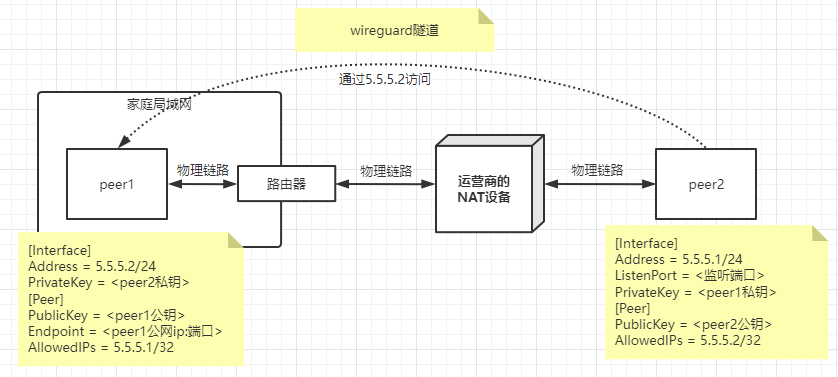
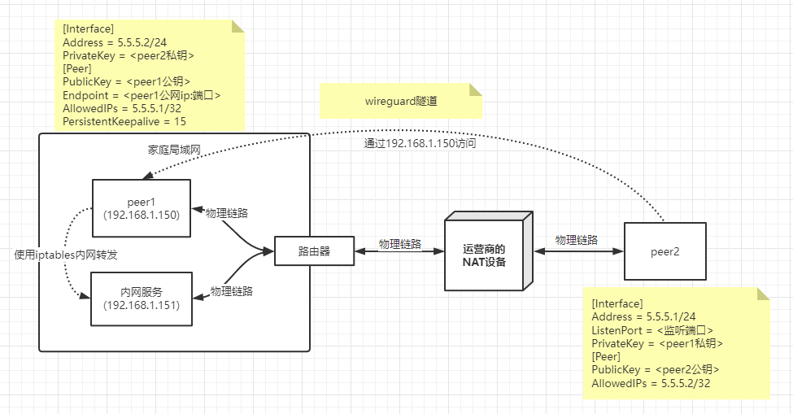
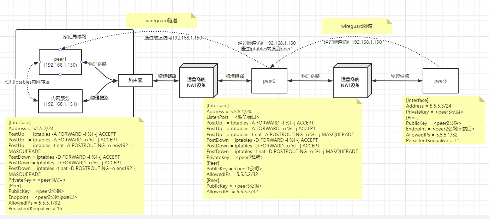

### 1、安装wireguard

- 官方安装手册：[https://www.wireguard.com/install/](https://link.zhihu.com/?target=https%3A//www.wireguard.com/install/)
- docker安装：[https://hub.docker.com/r/linuxserver/wireguard](https://link.zhihu.com/?target=https%3A//hub.docker.com/r/linuxserver/wireguard)

WireGuard 的安装条件**非常苛刻**，对内核版本要求极高，不仅如此，在不同的系统中，**内核，内核源码包，内核头文件**必须存在且这三者版本要一致，Red Hat、CentOS、Fedora 等系统的**内核，内核源码包，内核头文件**包名分别为 `kernel`、`kernel-devel`、`kernel-headers`；Debian、Ubuntu 等系统的**内核，内核源码包，内核头文件**包名分别为 `kernel`、`linux-headers`。果这三者任一条件不满足的话，则不管是从代码编译安装还是从 repository 直接安装，也只是安装了 `wireguard-tools` 而已。而 WireGuard 真正工作的部分，是 `wireguard-dkms`，也就是动态内核模块支持(DKMS)，是它将 WireGuard 编译到系统内核中。

目前 WireGuard 已经被合并到 `Linux 5.6` 内核中了，如果你的内核版本 >= 5.6，就可以用上原生的 WireGuard 了，只需要安装 wireguard-tools 即可，内核版本<5.6，可能需要首先更新内核，否则可能会报错：`Unable to access interface: Protocol not supported`，如下为更新内核版本示例（CentOS）。


#### 1) 升级内核

```sh
# 查看当前内核版本
uname --kernel-release

# 安装必要工具，卸载旧的内核源码包
yum -y install epel-release curl
sed -i "0,/enabled=0/s//enabled=1/" /etc/yum.repos.d/epel.repo
yum remove -y kernel-devel
​
# 导入公钥
rpm --import https://www.elrepo.org/RPM-GPG-KEY-elrepo.org
# 升级安装 elrepo
rpm -Uvh http://www.elrepo.org/elrepo-release-7.0-2.el7.elrepo.noarch.rpm
# 安装新版本工具包
yum --disablerepo="*" --enablerepo="elrepo-kernel" list available
yum -y --enablerepo=elrepo-kernel install kernel-ml
# 设置默认启动
sed -i "s/GRUB_DEFAULT=saved/GRUB_DEFAULT=0/" /etc/default/grub
grub2-mkconfig -o /boot/grub2/grub.cfg
wget https://elrepo.org/linux/kernel/el7/x86_64/RPMS/kernel-ml-devel-5.15.10-1.el7.elrepo.x86_64.rpm
rpm -ivh kernel-ml-devel-5.15.10-1.el7.elrepo.x86_64.rpm
yum -y --enablerepo=elrepo-kernel install kernel-ml-devel

# 重启
reboot

# 查看升级后的内核版本
uname --kernel-release
```

#### 2) 安装wireguard 

##### 通过官网方法安装

```sh
Method 1: a signed module is available as built-in to CentOS's kernel-plus:

$ sudo yum install yum-utils epel-release
$ sudo yum-config-manager --setopt=centosplus.includepkgs=kernel-plus --enablerepo=centosplus --save
$ sudo sed -e 's/^DEFAULTKERNEL=kernel$/DEFAULTKERNEL=kernel-plus/' -i /etc/sysconfig/kernel
$ sudo yum install kernel-plus wireguard-tools
$ sudo reboot
Method 2: users wishing to stick with the standard kernel may use ELRepo's pre-built module:

$ sudo yum install epel-release elrepo-release
$ sudo yum install yum-plugin-elrepo
$ sudo yum install kmod-wireguard wireguard-tools
Method 3: users running non-standard kernels may wish to use the DKMS package instead:

$ sudo yum install https://dl.fedoraproject.org/pub/epel/epel-release-latest-7.noarch.rpm
$ sudo curl -o /etc/yum.repos.d/jdoss-wireguard-epel-7.repo https://copr.fedorainfracloud.org/coprs/jdoss/wireguard/repo/epel-7/jdoss-wireguard-epel-7.repo
$ sudo yum install wireguard-dkms wireguard-tools
```


##### docker安装

```bash
docker pull linuxserver/wireguard
docker run -itd --entrypoint=bash \
  --name=wg \
  --cap-add=NET_ADMIN \
  --cap-add=SYS_MODULE \
  -e PUID=1000 \
  -e PGID=1000 \
  -v /lib/modules:/lib/modules \
  --sysctl="net.ipv4.conf.all.src_valid_mark=1" \
  linuxserver/wireguard 
```


### 2、利用公网机器对nat设备下机器点对点建立隧道

在wiregaurd中，节点之间是不区分服务端与客户端的，统一概念为peer。谁发起连接谁就是客户端，因此客户端需要配置endpoint。


建立以下图为示的隧道，使公网机器peer2能通过隧道访问到家庭局域网内的peer1。



#### 1) 公私钥生成

通过以下命令生成peer1和peer2公私钥。

```bash
# 生成公私钥到wg-pubkey和wg-prikey下。
wg genkey | tee wg1-prikey | wg pubkey > wg1-pubkey
wg genkey | tee wg2-prikey | wg pubkey > wg2-pubkey
```


#### 2) 编写配置文件

生成peer1和peer2的wiregurad配置文件

```ini
# 分别赋值
WG1_PRIKEY=`cat wg1-prikey`
WG1_PUBKEY=`cat wg1-pubkey`
WG2_PRIKEY=`cat wg2-prikey`
WG2_PUBKEY=`cat wg2-pubkey`
# 此例中以wg1作为服务端，所以endpoint配置成wg1的
WG1_IP=<peer1的公网ip>
WG1_PORT=<peer1监听端口>

# peer1的wireguard配置生成
cat > wg1.conf<<EOF
[Interface]
Address = 5.5.5.2/24
PrivateKey = ${WG2_PRIKEY}

[Peer]
PublicKey = ${WG1_PUBKEY}
Endpoint = ${WG1_IP}:${WG1_PORT}
AllowedIPs = 5.5.5.1/32
PersistentKeepalive = 15
EOF

#peer2的wireguard配置生成
cat > wg2.conf<<EOF
[Interface]
Address = 5.5.5.1/24
ListenPort = ${WG1_PORT}
PrivateKey = ${WG1_PRIKEY}

[Peer]
PublicKey = ${WG2_PUBKEY}
AllowedIPs = 5.5.5.2/32
EOF
```


参考生成配置如下

```ini
# peer1
[Interface]
Address = 5.5.5.2/24
PrivateKey = OHHeTtRg4kk3SFyxxbWJVlWO31y6xfD51OWQAQlwc2k=
[Peer]
PublicKey = GcKpj9v2kUojkHV3fgecW4VUzIgzD6HSoH2tCD7DOaTQ=
Endpoint = 172.0.0.2:10240
AllowedIPs = 5.5.5.1/32
# 每隔15s发送一个keepalive数据包
# PersistentKeepalive参数用于保持链接的存活，默认情况下wireguard在不使用的情况下尽量少发送数据包，但是在对于位于NAT后的peer1来讲，其公网地址随时都在变化，所以我们希望通过定时发送存活包让peer2知晓peer1的公网地址与对应的端口，保持链接的存活性，这就是所谓的IP漫游。
PersistentKeepalive = 15
```


```ini
# peer2
[Interface]
Address = 5.5.5.1/24
ListenPort = 10240
PrivateKey = SOSEvKhRG+7b0Ag9sqiRDOW9V10q3KEY+x3gMloh124=
[Peer]
PublicKey = SHZ2K6oIVSTdtPld3i7zJnXKOrKAwk1ynMn1mry5CF0=
AllowedIPs = 5.5.5.2/32
```


#### 3) 启动服务

将生成配置文件分别拷贝到两台机器上。

```bash
# 将配置文件拷贝到 /etc/wireguard 目录下。
cp wg1.conf /etc/wireguard

#启动
wg-quick up wg1

# 输出以下结果为启动成功
# 出现Unable to access interface: Protocol not supported 则内核未升级
#[#] ip link add wg1 type wireguard
#[#] wg setconf wg1 /dev/fd/63
#[#] ip -4 address add 5.5.5.1/24 dev wg1
#[#] ip link set mtu 1420 up dev wg1

# wg2操作相同
```


此时，首先要在`peer1`去ping通`peer2`后，`peer2`才能与`peer1`通行，因为需要由`peer1`根据endpoint进行隧道建立。此时简单的点对点隧道搭建完成。


### 3、在点对点基础上进行内网转发

建立以下图为示的隧道，使公网机器peer2能像在peer1局域网内一样，访问内网服务。



其中只对`peer1`的配置中添加了关于iptables的内网转发规则。实际上是将来自wiregurad的流量到输出到网卡进行转发。关于iptables可以了解一下其五链四表和一些[常用的规则](https://blog.csdn.net/togolife/article/details/123271091)


#### 1) 配置变化

- peer1需要添加路由转发规则

  ```ini
  # peer1
  [Interface]
  Address = 5.5.5.2/24
  # 启动时添加路由规则
  PostUp   = iptables -A FORWARD -i %i -j ACCEPT
  PostUp   = iptables -A FORWARD -o %i -j ACCEPT
  PostUp   = iptables -t nat -A POSTROUTING -o <网卡名称> -j MASQUERADE
  # 停止时删除路由规则
  PostDown = iptables -D FORWARD -i %i -j ACCEPT
  PostDown = iptables -D FORWARD -o %i -j ACCEPT
  PostDown = iptables -t nat -D POSTROUTING -o <网卡名称> -j MASQUERADE
  
  PrivateKey = OHHeTtRg4kk3SFyxxbWJVlWO31y6xfD51OWQAQlwc2k=
  [Peer]
  PublicKey = GcKpj9v2kUojkHV3fgecW4VUzIgzD6HSoH2tCD7DOaTQ=
  Endpoint = 172.0.0.2:10240
  AllowedIPs = 5.5.5.1/32
  # 每隔15s发送一个keepalive数据包
  # PersistentKeepalive参数用于保持链接的存活，默认情况下wireguard在不使用的情况下尽量少发送数据包，但是在对于位于NAT后的peer1来讲，其公网地址随时都在变化，所以我们希望通过定时发送存活包让peer2知晓peer1的公网地址与对应的端口，保持链接的存活性，这就是所谓的IP漫游。
  PersistentKeepalive = 15
  ```

- peer2需要添加peer配置中的allowIps

  ```ini
  [Peer]
  PublicKey = SHZ2K6oIVSTdtPld3i7zJnXKOrKAwk1ynMn1mry5CF0=
  AllowedIPs = 5.5.5.2/32,192.168.1.0/24
  PersistentKeepalive = 15
  ```

重新启动wg，再使用`peer2`去访问`192.168.1.151`即可。

### 4、公网机器充当中转机

**注意，应该先看直连方案后在看中转方案，中转方案是基于直连方案之上的。**且对wireguard配置文件有一定了解。

在现实情况中更多的场景是中转，如两台设备都处于NAT中，一台设备需要访问另外一台设备所处的内网，假设是peer1，peer2仍然是处于公网中的主机，peer3则是需要访问peer1中内网服务的主机，如下图所示：



peer3访问peer1的方式，就类似于我们windows办公机器需要通过公网机器中转到我们nat网络中。即我想要在外面通过笔记本电脑访问家里的非公网机器。


#### 1) 配置变化

- peer1相较前篇无配置变化

- peer2

  - 新增`[peer]`标签，代表新增`peer3`，填入对应peer3的公钥和ip地址即可。

  - 添加路由转发，与peer1的转发不同，该流量是从wg隧道输入，又从wg输出。

    ```ini
    PostUp   = iptables -A FORWARD -i %i -j ACCEPT
    PostUp   = iptables -A FORWARD -o %i -j ACCEPT
    PostUp   = iptables -t nat -A POSTROUTING -o %i -j MASQUERADE
    PostDown = iptables -D FORWARD -i %i -j ACCEPT
    PostDown = iptables -D FORWARD -o %i -j ACCEPT
    PostDown = iptables -t nat -D POSTROUTING -o %i -j MASQUERADE
    ```

- peer3配置peer1相似，在原有基础上去除转发即可。

peer3编写完成后，通过windows端wireguard导入配置，启动后即可访问到`192.168.1.151`


#### 2) 最终所有配置文件

- peer1

  ```ini
  [Interface]
  Address = 5.5.5.2/24
  PostUp   = iptables -A FORWARD -i %i -j ACCEPT
  PostUp   = iptables -A FORWARD -o %i -j ACCEPT
  PostUp   = iptables -t nat -A POSTROUTING -o ens192 -j MASQUERADE
  PostDown = iptables -D FORWARD -i %i -j ACCEPT
  PostDown = iptables -D FORWARD -o %i -j ACCEPT
  PostDown = iptables -t nat -D POSTROUTING -o ens192 -j MASQUERADE
  PrivateKey = OHHeTtRg4kk3SFyQAQlwc2k=
  
  [Peer]
  PublicKey = GcKpj9v2kUojkHV3fgecW4VUQ=
  Endpoint = <ip>:<port>
  AllowedIPs = 5.5.5.1/32
  PersistentKeepalive = 15
  ```

- peer2

  ```ini
  [Interface]
  Address = 5.5.5.1/24
  PostUp   = iptables -A FORWARD -i %i -j ACCEPT
  PostUp   = iptables -A FORWARD -o %i -j ACCEPT
  PostUp   = iptables -t nat -A POSTROUTING -o %i -j MASQUERADE
  PostDown = iptables -D FORWARD -i %i -j ACCEPT
  PostDown = iptables -D FORWARD -o %i -j ACCEPT
  PostDown = iptables -t nat -D POSTROUTING -o %i -j MASQUERADE
  ListenPort = 10240
  PrivateKey = SOSEvKhR10q3KEY+xzgMlohV24=
  
  [Peer]
  PublicKey = SHZEK6oIVSTdtPldnsmry5CF0=
  AllowedIPs = 5.5.5.2/32,192.168.1.0/24
  PersistentKeepalive = 15
  
  [Peer]
  PublicKey = O1TBQKHWeBhc7sHuzcFi9EmH0=
  AllowedIPs = 5.5.5.3/32
  PersistentKeepalive = 15
  ```

- peer3

  ```ini
  [Interface]
  PrivateKey = qCiw7PPXkYxwOIsF+0N6vVs=
  Address = 5.5.5.3/24
  
  [Peer]
  PublicKey = GcKpj9v2kUojkHV3HtCD7DOaTQ=
  AllowedIPs = 5.5.5.0/24, 192.168.1.0/24
  Endpoint = <ip>:<port>
  PersistentKeepalive = 15
  ```

  

### 参考

- [被Linux创始人称做艺术品的组网神器——WireGuard](https://zhuanlan.zhihu.com/p/447375895)
- [iptables详解及一些常用规则](https://blog.csdn.net/togolife/article/details/123271091)
- [WireGuard安装文档](https://www.wireguard.com/install/#ubuntu-module-tools)
- [Centos 7 下安装 Wireguard](https://www.cnblogs.com/zhenxing06/p/16049288.html)