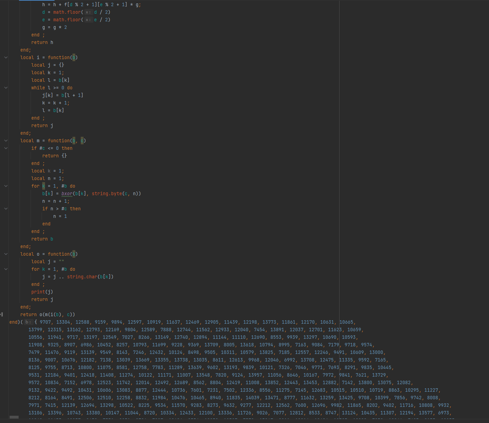
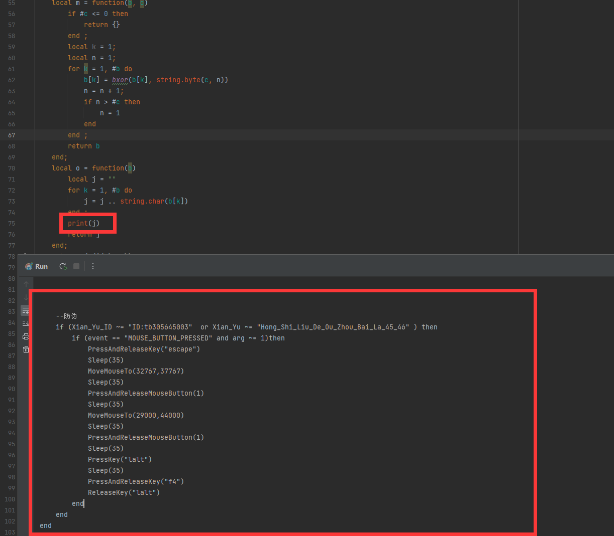

### 一、关于非绿玩的路线

#### 1、通用抖枪宏

​	我是从玩apex这款游戏开始接触到《非绿玩》的圈子的，因为是起源引擎，所以我相信大家都听说过大名鼎鼎的抖枪术，其原理是在玩家因需要将准心持续跟着高速移动的目标时，会抵消或完全消除后座力，第一次接触抖枪术的时候，是在R301左右移动无后座，后来又在罗技（apex白名单）上面使用按下之后左右抖动的方式进行模拟这个操作，效果其实也还不错。

​	后来想到闲鱼上买个专业的宏看一下和我写有什么区别，发现其实就是一坨lua脚本被不怎么灵光的加密方式加密过的一堆不怎么灵过的代码。看解密前代码：

​	使用load函数动态加载文本代码，我们只要轻轻的在最后一层function下加入print，代码就全部被输出出来了。

​	发现了标注为红石榴，咸鱼id还和我买的那家不一样（杜绝盗卖狗），但是其实里面的逻辑很简单，就是左右摇鼠标，然后一定间隔后下压，循环到一直右键放开。

​	这种脚本虽然简单暴力，但也出其的有效，对于vk，死敌，301这些长枪，能够4倍镜能把站着不动的人在很远的距离抽残抽死。但对于一些高射速的近冲，r99,CAR来说，下压还是不太够，这时候加抖动幅度又太抖，加频率也没效果。但加下压值又会导致其他枪械下压过度。

#### 2、枪械识别宏

为了解决通用抖枪宏的问题，需要对枪械进行识别，然后动态的修改宏脚本，我们在通用抖枪宏中已经知道了lua有动态加载脚本的能力。由于基于罗技api的缘故，其内部隔离了很多原有方法。

基于以上条件，就无法在罗技内部实现枪械识别的功能，但有一个函数可以帮助我们动态加载脚本（dofile函数），关于dofile的功能：dofile (FILENAME) 加载文件中的代码，且加载代码时遇到错误会报错。这个加载代码，在遇到已被定义的方法时会覆盖（类似java重写方法的概念）。并且dofile对于性能的损耗并不是高，有这么一个函数，我们就可以想象出，可以通过外部程序识别枪械，然后更改dofile(filename)参数中filename的文件内容，这样一来，每次触发的事件处理将是可控的。

#### 3、AI自瞄

