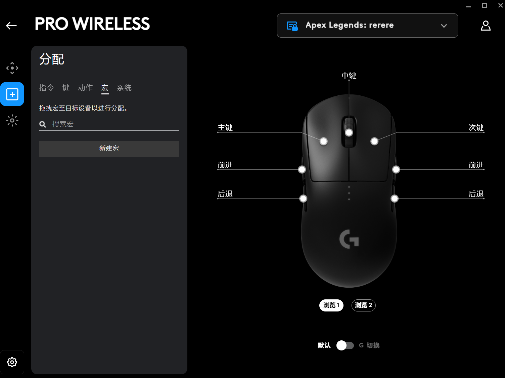
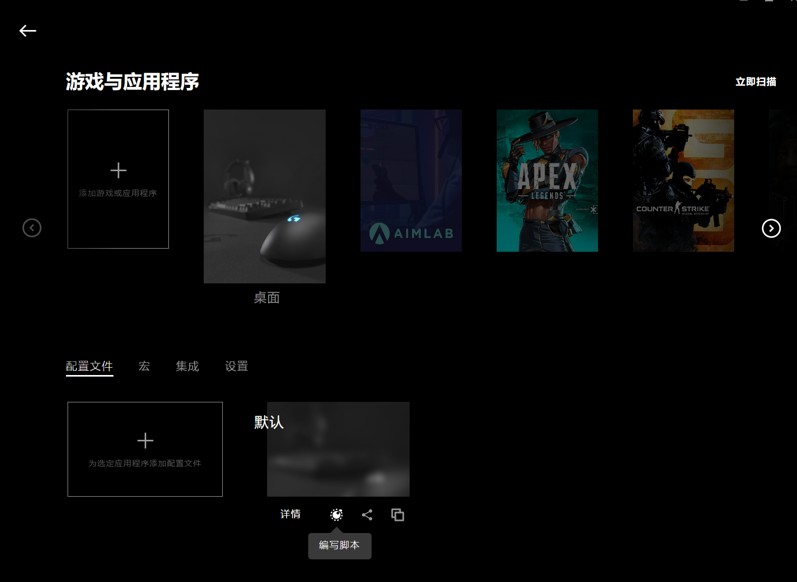
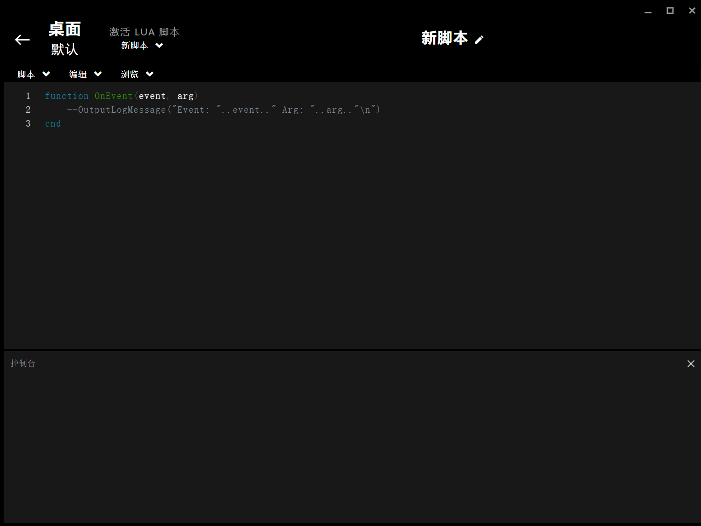
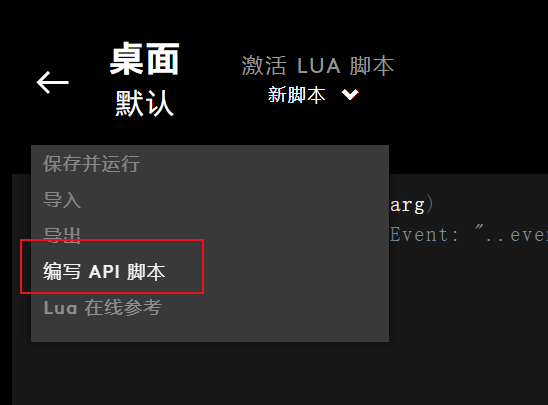

### 罗技宏简单介绍

罗技允许在其键位上配置映射的按键集合，能实现一键触发相应间隔与执行顺序的一组按键指令。

但要实现比较复杂的触发场景，需要使用到罗技的配置文件设置，其中运行编写Lua脚本

可以在左上角脚本->编写API脚本中获取到罗技的api文档，其中核心api包括鼠标与键盘的操作，判断Lock键状态等

 

### 自动识别并修改脚本原理

基于lua脚本的dofile函数，可读取文件内容并当成代码块执行，

