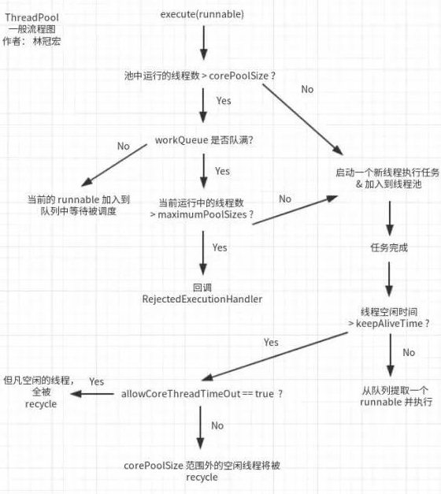

1.说一说你使用的是什么样的线程池，自定义线程池的几个参数是什么

```
public ThreadPoolExecutor(
    int corePoolSize,
    int maximumPoolSize,
    long keepAliveTime,
    TimeUnit unit,
    BlockingQueue<Runnable> workQueue,
    ThreadFactory threadFactory,
    RejectedExecutionHandler handler
) 
```

| 参数名                   | 作用                                                         |
| ------------------------ | ------------------------------------------------------------ |
| corePoolSize             | 队列没满时，线程最大并发数                                   |
| maximumPoolSizes         | 队列满后线程能够达到的最大并发数                             |
| keepAliveTime            | 空闲线程过多久被回收的时间限制                               |
| unit                     | keepAliveTime的时间单位                                      |
| workQueue                | 阻塞的队列类型                                               |
| RejectedExecutionHandler | 超出maximumPoolSize+workQueue时，任务会交给RejectedExecutionHandler来处理 |


corePoolSize，maximumPoolSize，workQueue之间关系。

- 当线程池中线程数小于corePoolSize时，新提交任务将创建一个新线程执行任务，即使此时线程池中存在空闲线程。
- 当线程池中线程数达到corePoolSize时，新提交任务将被放入workQueue中，等待线程池中任务调度执行 。
- 当workQueue已满，且maximumPoolSize > corePoolSize时，新提交任务会创建新线程执行任务。
- 当workQueue已满，且提交任务数超过maximumPoolSize，任务由RejectedExecutionHandler处理。
- 当线程池中线程数超过corePoolSize，且超过这部分的空闲时间达到keepAliveTime时，回收这些线程。
- 当设置allowCoreThreadTimeOut(true)时，线程池中corePoolSize范围内的线程空闲时间达到keepAliveTime也将回收。


2.说一说线程池的执行流程




3.你的项目中定义的核心线程数、最大线程数和队列大小是如何定义的？为什么这样定义？（这道题根绝我导师给我说是一个加分项）


4.在项目中如何防止超卖现象


5.你的下订单的sq语句如何编写的？（考察MySQL的乐观锁）
6.如果有用户反错说整个系统的反错比较慢，你是如何排查和如何解决问题的？
7.影响系统响应慢的原因有哪些？
8.算法题：给定一个无序数组和一个目标值，找出数组中两个数之和等于目标值的所有组合，并指出其时间复杂度。（很简单的一个算法题，leetcode easy难度）
9.了解过JVM内存模型么？说说哪些是线程独享、哪些是线程共享的？

java栈，本地方法栈，程序计数栈是线程独享，

方法区和堆是线程共享。


10.详细说一下Java堆的分区，他们的比例，以及如果把比例调大以后会有什么样的后果？
11.说一下JVM的GC算法，以及为什么”标记-整理”法更好一些，他能解决什么样的问题？
12.了解过Java类加载机制么？一共有哪几种类加载器？
13.如果你想查看线上正在运行的服务的GC日志，你需要输入什么指令？
14.了解过HashMap么，说一下HashMap的原理。
15.如果两个对象hashCode相同，则一定是相同对象么，如果是两个相等的对象，那么他们的hashCode相同么？
16.如何解决hash冲突？
17.HashMap是线程安全的么，如何把HashMap变成线程安全的类？
18.说一说MySQL数据库有哪些数据库引擎？
19.InnoDB的索引的数据结构是什么，说一说他的原理20.数据库事务等级以及他们解决了什么问题，请举例说明一下21.MySQL默认的事务等级是什么？
22.MySQL如何开启慢查询？
23.说一下Spring主要包含哪些模块？
24.说一下你对Spring的IOC容器的理解以及启动流程25.有了解过RPC框架或分布式的东西么？（这个后来问面试言，就是考察对新技术的了解以及对互联网发展的一个关注度）
26.说一下你读过的有关Java的书籍