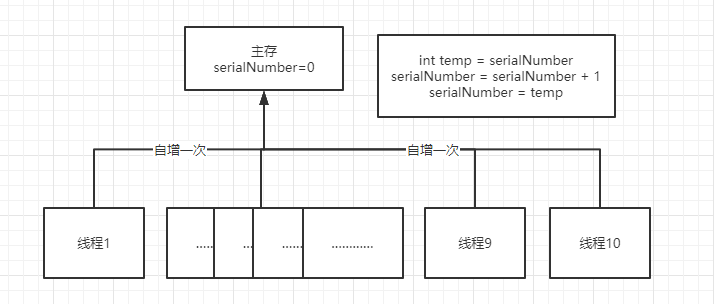

## 面试准备

我是广州航海学院应届本科毕业生，专业是计算机科学与技术，应聘的职位是java后端开发。在大学三年来积极参与学校技术团队，大二时加入过学院的信息安全工作室，参加比赛并获得过国赛的赛区二等奖。大三时加入学院的软件开发团队。带领团队编写一个智能制造erp系统。比较喜欢开发，大二时组装了一台物理机去维护一个自己编写的打字软件提供给五笔圈子的人使用。

我是来自广州航海学院的应届本科生，专业是计算机科学与技术，面试的岗位是软件研发工程师，我叫郑锦龙。大学三年来努力提升自己的专业知识，积极参加学校技术团队，大一时为了提升自己的打字速度去学习了类似五笔的那种固定编码输入法，在这个基础下自主开发了一个练习打字软件供给自己和圈子里的人使用，大二时加入过学院的信息安全工作室，参加比赛并获得过国赛的赛区二等奖。大三时加入学院的软件开发团队。带领团队编写一个智能制造erp系统。一直到大四上学期大概五月份左右，就开始找实业工作，成功加入到一个公司实习过四个月左右。我认为我的大学过的还是比较充实的。

业余的兴趣爱好是轮滑和游泳，平时会在一些闲暇的周末和社团的人去爬山喝茶或穿上轮滑刷街。在暑假时会报游泳的月卡去游泳。还有一个特殊的爱好是练习打字，所以一些零碎的非常少的几分钟间隙里我也会打开打字器去练习五笔去打一篇文章。

项目整理：

跟打器：

是一款具有对照框，打字框的练习打字的软件，有三种模式，跟打，看打，听打。

客户端，使用swing实现。

跟打实现比较简单，就是对对照框和打字框一一对应。打对了就显示为灰色。打错了对照框相应的字的背景就显示为红色。让用户跟着背景提示去跟着打。这个模式下还能设置类似五笔有固定编码对应固定文字的输入法的编码提示的支持。来达到提示用户怎么打才能打出最少的键盘击键数来打完这个文章。有时候会出现叠词，“你好像”，“你好”和“好像”在用户词库是都有对应的词的。这个时候可以计算出用户需要打哪个词需要的击键比较少。来在对照框上提示。使用的是最短编辑路径的变式来实现的。

看打实现的是不一一对照的形式。对照框只会自动滚动翻页。让用户跟随着打，没有任何提示，这个时候生成成绩的时候就不能一一对应，会生成一张标注漏打，少打，错打的成绩单。这也是最短编辑路径的变式来。

听打有两部分文件组成，一部分是txt文件，一部分是mp3文件，其实跟看打是一样的，只是把看打中的对照框内容隐藏，然后直接拿mp3进行播放。与对照框被隐藏的内容进行看打中的算法处理。

然后还具有分享文章等一些比较琐碎的功能，这里的分享文章是通过发送到q群里分享的，调用到user32的动态链接库来获取群句柄并且发送信息的。这里各个跟打器有规范各个打字器作者的格式。可以让别的打字器也能获取到分享的文章。

机器人端：

使用了一个叫picqbox的qq机器人框架实现的。主要是用来兼容其他打字器发送成绩。因为在这个圈子中有挺多作者，我们会规范成绩的格式，以达到发送到对应的打字群中。可以互相收录成绩。

所以机器人的功能就是收录不同跟打器发送的成绩。还有举办一些比赛，都会将文章发送到群中，让群里用各种打字器的人都能参加。

服务端：。

大致上就是，将用户的信息，打字记录。还有为机器人端提供调用接口

其实就是进行一些增删改查，还有做一些统计的功能

因为在服务端要记录每次跟打的记录，我认为一个用户所产生的跟打记录是比较多的。一天有的人就能打3w字左右，而每次产生的记录就会有一个文本字段。如果打的是重复的文本，就会让数据库冗余十分严重。所以我把这些文本放进一个文章池里面。用id做关联。这样就能使数据不过于庞大。

有一个功能是生稿赛。一天只能获取一次，在客户端中被禁止修改。

erp：

背景就是有一个工厂要求追踪流程。让老师外包给我们的一个项目。

我负责的部分就是：最开始的与老师和工厂经理确定需求，建立表结构。管理建立结构和实现过程的文档。

搭建springboot整体运行的脚手架。

鉴权模块：使用的是security去做的网关模块，等级划分为角色-菜单-资源-权限。最细颗粒对应前端是按钮级别的资源限制访问。整个鉴权模块都是我在负责的。

生产模块：有生产任务和生产工序，生产任务有多个生产工序，先创建生产任务再在任务下创建工序，工序中要绑定生产订单。当生产工序结束后，要用rfid进行良品和不良品的分类扫描。所以在工序结束后要计算出良品率。当所有工序完成后，这个生产任务完成了。

对服务器进行运维：用docker管理和运行项目。搭建了jenkins去做开发中的cicd。有使用到关于ssh与scp的指令去上传。https://www.jianshu.com/p/da0b12743ad4。对docker运维这块没有上k8s做容器编排（一是因为没必要，集群太小。二是因为不会），但有一个邮件系统去做docker的整个运行状态的监控。https://www.jianshu.com/p/e1f46ffcddce。

对整个开发穿插着一些需求探讨，协助bug修复，代码review。

### java基础

#### 基本类型和占用字节

| 类型    | 占用字节      | 范围                 |
| ------- | :------------ | -------------------- |
| byte    | 1字节         | -2^7到2^7-1          |
| short   | 2字节         | -2^15~2^15-1         |
| int     | 4字节         | -2^31~ 2^31-1        |
| long    | 8字节         | -2^63~2^63-1         |
| char    | 2字节         |                      |
| float   | 4字节         | -3.4e+38 ~ 3.4e+38   |
| double  | 8字节         | -1.7e+308 ~ 1.7e+308 |
| boolean | 1bit, 1/8字节 |                      |

#### java异常

| 异常类型                      | 说明                                                  |
| ----------------------------- | ----------------------------------------------------- |
| Exception                     | 异常层次结构的根类                                    |
| RuntimeException              | 运行时异常，多数 java.lang 异常的根类                 |
| ArithmeticException           | 算术谱误异常，如以零做除数                            |
| ArraylndexOutOfBoundException | 数组大小小于或大于实际的数组大小                      |
| NullPointerException          | 尝试访问 null 对象成员，空指针异常                    |
| ClassNotFoundException        | 不能加载所需的类                                      |
| NumberFormatException         | 数字转化格式异常，比如字符串到 float 型数字的转换无效 |
| IOException                   | I/O 异常的根类                                        |
| FileNotFoundException         | 找不到文件                                            |
| EOFException                  | 文件结束                                              |
| InterruptedException          | 线程中断                                              |
| IllegalArgumentException      | 方法接收到非法参数                                    |
| ClassCastException            | 类型转换异常                                          |
| SQLException                  | 操作数据库异常                                        |

### jvm

1、类加载子系统运行流程

加载(loading)->链接(linking)->初始化(init)

2、链接的步骤

验证 Verify ->准备 Prepare  ->解析 Resolve

3、类加载器的分类

引导类加载器、扩展加载器、应用加载器、系统加载器

4、双亲委派机制

把类加载的请求交给父类处理，一直向上委托直到顶层的引导类加载器，父类加载器无法处理，子类加载器才会尝试自己加载。

5、jvm的结构

类加载器子系统、运行时数据库，执行引擎。

6、运行时数据区里有什么内容

程序计数器，虚拟机栈，本地方法接口，本地方法栈，堆，方法区，内存。

7、程序计数器的作用

用来存储指向下一条指令的地址。由执行引擎读取下一条指令

8、栈帧里的内容

局部变量表、操作数栈、动态链接、方法返回地址、附加信息

9、怎么调整栈的大小

通过-Xss设置栈的大小，内容不足会出现OOM

10、Class.forName()和ClassLoader.loadClass

class.forName()除了将类的.class文件加载到JVM中之外，还会对类进行解释，执行类中的static块。
而classLoader只干一件事情，就是将.class文件加载到JVM中，不会执行static中的内容,只有在newInstance才会去执行static块。

判断对象存活方法：

- 引用计数法
- 可达性分析法

引用类型：

- 强引用：存在直接的引用联系
- 软引用：java.lang.ref.SoftReference类，只有在内存不足时才会回收该对象
- 弱引用：用java.lang.ref.WeakReference，软引用关联的对象只有在内存不足时才会被回收，而被弱引用关联的对象在JVM进行垃圾回收时总会被回收。
- 虚引用：在java中用java.lang.ref.PhantomReference类表示。如果一个对象与虚引用关联，则跟没有引用与之关联一样，在任何时候都可能被垃圾回收器回收。虚引用主要用来跟踪对象被垃圾回收的活动。

垃圾回收算法与其缺点：

- 标记-清除算法：标记出所有需要回收的对象，标记完成后，统一回收掉所有被标记的对象，也可以反过来。标记存活的对象，回收所有未被标记的对象。
  - 执行效率不稳定，标记和清除两个过程的执行效率都随对象数量增长而降低
  - 内存空间碎片化，标记、清楚会产生大量不连续的内存碎片。
- 标记-复制算法：将内存划分成相等的两块，只使用其中一块，当这一块内存使用完，就将存活对象复制到另外一块上，然后清理这一块的内存
  - 当大多数对象都是可存活时，产生大量的内存复制开销
  - 内存代价较大。可用内存为原来的一半
- 标记-整理算法：将存活的对象移动到内存的一端，然后清理掉便捷外的内存。
  - 移动存活对象要更新所有引用这些对象的地方，这种操作需要全程暂停用户应用程序才能进行。

### 多线程

多线程的性质：原子性，可见性，有序性

1、volatile关键字的作用

设置多个线程共享数据是内存可见的。在每次操作时都直接从主存中读写，而不使用缓存

可见性，非原子性

2、CAS算法

更新数据前先取一次预估值A，在对数据更新为数值B时，另A与内存值V对比，如果A==V，才将V改成B。否则重新拉取对比。

3、CAS算法的缺点

在并发量较高时，CAS可能会因为更新不成功一直做循环。而且只能保证某个数据的原子性而不能保证某块代码的原子性

4、ConcurrentHashMap

在jdk8以前使用的是锁分段机制，jdk8以后使用的是CAS算法，相对于treeTable中使用的`synchronized`,CAS较轻，所以推荐使用ConcurrentHashMap

5、CopyOnWriteArrayList和CopyOnWriteArraySet

这两个在读的时候不设锁，在进行修改操作时，会复制一个新的List并在复制的list上进行操作，然后再将变量引用指到这个新的list上

6、线程八锁的原理

实际上就是锁的对象不同，一个是锁实例对象，一个是锁Class对象

7、线程池的构造参数有哪些

corePoolSize 线程池核心线程大小，

maximumPoolSize 线程池等待队列满后的线程池大小，

keepAliveTime 空闲线程存活时间，

unit 空闲线程存活时间单位，

workQueue 工作队列类型

threadFactory 线程工厂，用于创建线程，一般可以用默认的

handler 拒绝策略，当任务过多时候，如何拒绝任务。

8、线程池工作队列类型有哪几种

ArrayBlockingQueue：基于数组的有界阻塞队列。队列满时，会执行拒绝策略

LinkeBlockingQueue：基于链表的无界阻塞队列。线程池核心线程占满后，会一直存入该队列，所以在这个队列类型时，maximumPoolSize参数不起作用。

SynchronousAQueue：不缓存任务的阻塞队列，进队后，直接创建新线程，如果线程达到maximumPoolSize，则会执行拒绝策略。

PriorityBlockingQueue：具有优先级的无界阻塞队列

9、线程的创建方式

类自身继承Thread，然后new这个类后使用start方法。

类自身实现Runnable接口，然后自行new Thread()

10、线程的停止

不推荐使用stop方法，应该让他自己停止，如果循环，要使用标志位时线程终止。

11、线程的操作

sleep休眠、yield礼让、join强行执行、getState线程状态观测、priority优先级改变、daemom守护线程启动。

12、死锁产生的条件

- 互斥条件：一个资源每次只能被一个进程使用
- 请求与保持条件：一个进程因请求资源而阻塞时，对已获得的资源保持不放。
- 不剥夺条件：进程已获得的资源，在未使用完之前，不能强行剥夺。
- 循环等待条件：若干进程之间形成一种头尾相接的循环等待资源关系。

13、ReentrantLock锁（可重入锁）

14、线程与进程的区别

- **进程是资源分配的最小单位，线程是CPU调度的最小单位**

- 同一个进程可以包含多个线程，至少包含一个线程，一个线程只能存在于一个进程中。

- 进程间的数据很难共享，同一个进程下的所有线程能够共享该进程下的资源。

- 进程间不会互相影响。

- 线程在执行时是同步和互斥的，因为他们共享同一个进程下的资源。

**一个进程是不是可以创建无限数量的线程？**

　　不是。

　　操作系统给一个系统进程提供的空间是2GB ，而一个线程堆栈的空间默认在启动的时候是1MB，理论上最大线程数=2GB/1MB=2048。但是内存当然不可能完全拿来作线程的栈，所以实际数目要比这个值要小。你也可以通过连接时修改默认栈大小，将其改的比较小，这样就可以多开一些线程。如将默认栈的大小改成512K，这样理论上最多就可以开4096个线程。

15、java线程状态

- **新建状态(New):** 线程对象被创建后，就进入了新建状态。例如，Thread thread = new Thread()。

- **就绪状态(Runnable):** 也被称为“可执行状态”。线程对象被创建后，其它线程调用了该对象的start()方法，从而来启动该线程。例如，thread.start()。处于就绪状态的线程，随时可能被CPU调度执行。

- **运行状态(Running):** 线程获取CPU权限进行执行。需要注意的是，线程只能从就绪状态进入到运行状态。

- **阻塞状态(Blocked):** 阻塞状态是线程因为某种原因放弃CPU使用权，暂时停止运行。直到线程进入就绪状态，才有机会转到运行状态。阻塞的情况分三种：
  - (01) 等待阻塞 -- 通过调用线程的wait()方法，让线程等待某工作的完成。
  - (02) 同步阻塞 -- 线程在获取synchronized同步锁失败(因为锁被其它线程所占用)，它会进入同步阻塞状态。
  - (03) 其他阻塞 -- 通过调用线程的sleep()或join()或发出了I/O请求时，线程会进入到阻塞状态。当sleep()状态超时、join()等待线程终止或者超时、或者I/O处理完毕时，线程重新转入就绪状态。

- **死亡状态(Dead):** 线程执行完了或者因异常退出了run()方法，该线程结束生命周期。

### io模型

- 阻塞io模型 bio
- 非阻塞io模型 nio
- 多路复用
- 信号驱动
- 异步

异常类型：

### 数据结构

#### 排序

### mysql

#### 引擎类型

- InnoDB：支持事务，行锁设计、支持外键，默认读取操作不会产生锁。并且是mysql5.5.8以后的默认存储引擎。
- MyISAM：不支持事务、表锁设计，支持全文索引。只缓存索引文件。mysql5前默认支持表大小为4GB，之后默认支持256TB单表数据。
- NDB
- Memory：速度快，存储引擎默认使用哈希索引。不支持TEXT和BLOB类型。变长字段(varchar)按照常字段(char)进行，浪费内存。mysql中临时表就使用的memory引擎若超过引擎表容量或者含有TEXT和BLOB类型字段，则会自动转换成MyISAM引擎存放到磁盘中。
- Archive
- Federated
- Maria

#### 索引

##### 索引类型

- 二级索引（辅助索引）
  - 唯一索引
  - 主键索引
- 复合索引（联合索引）：两个或更多个列上的索引
- 聚簇索引：在MySQL中，选定主键之后将会自动为主键创建索引。该索引可以维护主键的唯一性。非叶子节点包含了主键值，而叶子节点则指向了一条完整的记录
- 覆盖索引：通过辅助索引就可以得到查询的记录所做的索引优化

##### 索引数据结构

- B+树

  

  ​	①.全值匹配：指的是和索引中所有列进行匹配。假设以(姓，名，出生日期)三个数据项建立复合索引，那么可以查找姓名为张三，出生日期在2000-12-12的人 
  ​	②.匹配最左前缀：假设以(姓，名，出生日期)三个数据项建立复合索引，可以查找所有姓张的人 
  ​	③.匹配列前缀：假设有姓为司徒，司马的人，我们也可以查找第一列的前缀部分，如查找所有以司开头的姓的人 
  ​	④.匹配范围值：可以查找所有在李和张之间的姓的人，注意范围查询只在复合索引的优先排序的第一列。（假设姓名按照拼音排序） 
  ​	⑤.精确匹配前面列并范围匹配后一列：可以查找姓李并出生日期在2000-12-12之后的人或姓名为张三并出生日期在2000-12-12之后的人，注意范围第一个范围查询后面的列无法再使用索引查询 
  ​	⑥.只访问索引的查询：即查询只需访问索引，而无需访问数据行。（此时应想到索引中的覆盖索引）

- B树

  

  ​	①.如果不是按照索引的最左列开始查找，则无法使用索引。如无法查找名为龙的人，也无法查找在2000-12-12之后出生的人，当然也无法查找姓中以龙结尾的人（注意为和含有的区别） 
   	②.不能跳过索引中的列：无法查找姓李并在2000-12-12之后出生的人 
   	③.如果查询中包括某个列的范围查询，则其右边所有列都无法使用索引优化查询

- 哈希索引

  

##### 索引有效与失效

以索引key{last_name, first_name, dob)为例

**索引有效情况**

1. 全位匹配：
   全值匹配指的是和索引中的所有列进行匹配， 例如前面提到的索引可用于查找姓名为CubaAllen、出生于1960-01-01 的人。
2. 匹配最左前级
   前面提到的索引可用于查找所有姓为Allen 的人， 即只使用索引的第一列。
3. 匹配到前级
   也可以只匹配某一列的值的开头部分。 例如前面提到的索引可用于查找所有以J开头的姓的人。 这里也只使用了索引的第一列。
4. 匹配范围值
   例如前面提到的索引可用于查找姓在Allen 和B arrymore之间的人。 这里也只使用了索引的第一列。
5. 精确匹配第一列并范围匹配另外一列
   前面提到的索引也可用于查找所有姓为Allen，井且名字是字母K开头（比如Kim、 Karl等） 的人。 即第一列last_name也全匹配，第二列first_name范围匹配。
6. 只访问索引的查询
   B-Tree通常可以支持 “只访问索引的查询”，即查询只需要访问索引， 而无须访问 数据行。 后面我们将单独讨论这种 “覆盖索引” 的优化。

**索引失效情况**

1. 最左前缀原则:如果索引了多列，要遵守最左前缀法则。指的是查询从索引的最左前列开始并且不跳过索引中的列。
2. 不能使用索引中范围条件右边的列的索引
3. 在使用不等于（!=或者<>）的时候无法使用索引会导致全表扫描
4. like以通配符开头查询也会导致索引失效,以通配符结尾不会
5. 用函数转换
6. 列类型不一致的隐式转换

#### 事务特性：ACID

- **原子性(atomicity)：** 事务是最小的执行单位，不允许分割。事务的原子性确保动作要么全部完成，要么完全不起作用；
- **一致性(consistency)：** 执行事务前后，数据保持一致，例如转账业务中，无论事务是否成功，转账者和收款人的总额应该是不变的；
- **隔离性(isolation)：** 并发访问数据库时，一个用户的事务不被其他事务所干扰，各并发事务之间数据库是独立的；
- **持久性(durability)：** 一个事务被提交之后。它对数据库中数据的改变是持久的，即使数据库发生故障也不应该对其有任何影响。

#### 事务会发生的问题

- **脏读（Dirty read）:** 当一个事务正在访问数据并且对数据进行了修改，而这种修改还没有提交到数据库中，这时另外一个事务也访问了这个数据，然后使用了这个数据。因为这个数据是还没有提交的数据，那么另外一个事务读到的这个数据是“脏数据”，依据“脏数据”所做的操作可能是不正确的。
- **丢失修改（Lost to modify）:** 指在一个事务读取一个数据时，另外一个事务也访问了该数据，那么在第一个事务中修改了这个数据后，第二个事务也修改了这个数据。这样第一个事务内的修改结果就被丢失，因此称为丢失修改。 例如：事务1读取某表中的数据A=20，事务2也读取A=20，事务1修改A=A-1，事务2也修改A=A-1，最终结果A=19，事务1的修改被丢失。
- **不可重复读（Unrepeatableread）:** 指在一个事务内多次读同一数据。在这个事务还没有结束时，另一个事务也访问该数据。那么，在第一个事务中的两次读数据之间，由于第二个事务的修改导致第一个事务两次读取的数据可能不太一样。这就发生了在一个事务内两次读到的数据是不一样的情况，因此称为不可重复读。
- **幻读（Phantom read）:** 幻读与不可重复读类似。它发生在一个事务（T1）读取了几行数据，接着另一个并发事务（T2）插入了一些数据时。在随后的查询中，第一个事务（T1）就会发现多了一些原本不存在的记录，就好像发生了幻觉一样，所以称为幻读。

#### 事务隔离级别

- **READ-UNCOMMITTED(读取未提交)：** 最低的隔离级别，允许读取尚未提交的数据变更，**可能会导致脏读、幻读或不可重复读**。
- **READ-COMMITTED(读取已提交)：** 允许读取并发事务已经提交的数据，**可以阻止脏读，但是幻读或不可重复读仍有可能发生**。
- **REPEATABLE-READ(可重复读)：** 对同一字段的多次读取结果都是一致的，除非数据是被本身事务自己所修改，**可以阻止脏读和不可重复读，但幻读仍有可能发生**。
- **SERIALIZABLE(可串行化)：** 最高的隔离级别，完全服从ACID的隔离级别。所有的事务依次逐个执行，这样事务之间就完全不可能产生干扰，也就是说，**该级别可以防止脏读、不可重复读以及幻读**。

#### 试题

1. **为什么一般情况下，我们建表的时候都会使用一个自增的id来作为我们的主键？**

   InnoDB中表中的数据是直接存储在主键聚簇索引的叶子节点中的，每插入一条记录，其实都是增加一个叶子节点，如果主键是顺序的，只需要把新增的一条记录存储在上一条记录的后面，当页达到最大填充因子的时候，下一跳记录就会写入新的页中，这种情况下，主键页就会近似于被顺序的记录填满。

   　　若表的主键不是顺序的id，而是无规律数据，比如字符串，InnoDB无法加单的把一行记录插入到索引的最后，而是需要找一个合适的位置（已有数据的中间位置），甚至产生大量的页分裂并且移动大量数据，在寻找合适位置进行插入时，目标页可能不在内存中，这就导致了大量的随机IO操作，影响插入效率。除此之外，大量的页分裂会导致大量的内存碎片。

2. **相比于叶子节点中存储行指针，二级索引存储主键值会占用更多的空间，那为什么要这样设计呢？**

　　InnoDB在移动行时，无需维护二级索引，因为叶子节点中存储的是主键值，而不是指针。

3. **那么InnoDB有了聚簇索引，为什么还要有二级索引呢？**

　　聚簇索引的叶子节点存储了一行完整的数据，而二级索引只存储了主键值，相比于聚簇索引，占用的空间要少。当我们需要为表建立多个索引时，如果都是聚簇索引，那将占用大量内存空间，所以InnoDB中主键所建立的是聚簇索引，而唯一索引、普通索引、前缀索引等都是二级索引。

### 分布式

#### CAP

- 一致性（C）：在分布式系统中的所有数据备份，在同一时刻是否同样的值。（等同于所有节点访问同一份最新的数据副本）

- 可用性（A）：在集群中一部分节点故障后，集群整体是否还能响应客户端的读写请求。（对数据更新具备高可用性）

- 分区容忍性（P）：以实际效果而言，分区相当于对通信的时限要求。系统如果不能在时限内达成数据一致性，就意味着发生了分区的情况，必须就当前操作在C和A之间做出选择

### 集合

- hashMap的hash算法：

  - 无符号右移16位后做异或运算：做高低位二进制特征混合。后面做(n-1)&hash时以防丢失高区特征减少哈希碰撞

  - 槽位必须为2^n：槽位为2^n,可以使2^n-1二进制上的全为1，在对hash相与不会被0屏蔽特征，最终目的还是增加哈希桶的使用率，减少哈希碰撞

  - 用与运算对2^n取余做优化：对位为n以上进行高位屏蔽，剩下的就是余数的二进制数，只对2^n有效。

  - 扩容时，判断hash与旧容量是否为0，为0则不做操作，不为0对原桶位+上旧容量，因为扩容时是旧容量左移一位。用16扩容32为例，在原计算

    hash&(16-1=1111)在第五位上被屏蔽。在扩容时只需要判断第五位是否为0。

    即对hash&(16=10000)，若为0则在对hash&(32-1=11111)时与hash&(16-1=1111)得出的不变，不为零时则直接加上16即可。

- hashMap与hashTable
  - 二者的存储结构和解决冲突的方法都是相同的。
  - hashMap线程不安全，hashTable线程安全，加了synchronized 
  - HashTable在不指定容量的情况下的默认容量为11，而HashMap为16，Hashtable不要求底层数组的容量一定要为2的整数次幂，而HashMap则要求一定为2的整数次幂。、
  - Hashtable中key和value都不允许为null，而HashMap中key和value都允许为null
  - Hashtable扩容时，将容量变为原来的2倍加1，而HashMap扩容时，将容量变为原来的2倍。
  - Hashtable计算hash值，直接用key的hashCode()，求索引时使用取模运算，HashMap的hash值是高低16位异或，求索引时使用hash&(n-1)

- hashMap在并发下的问题
  - 在addEntry()方法中，会将头部同时归于不同两个并发线程的entry下，会导致其中一个add丢失。
  - resize()后执行rehash()，线程原始数据可能不一

- CopyOnWriteArrayList

  CopyOnWriteArrayList也是使用数组实现的，其中还使用了可重入锁ReentrantLock实现线程同步，只有在修改list的时候才会锁住操作部分，在修改时将原数组拷贝到新变量中，对新变量进行修改，再将原变量的引用指向新变量，再释放锁。

### 框架

#### springmvc

tcp:

SYN(synchronous建立联机) 

ACK(acknowledgement 确认) 

PSH(push传送) 

FIN(finish结束) 

RST(reset重置) 

URG(urgent紧急)

Sequence number(顺序号码) ：我方发送序列

Acknowledge number(确认号码)：需要下次接受到的序列

**第一次握手：**客户端发送syn包(seq=x)到服务器，并进入SYN_SEND状态，等待服务器确认;

**第二次握手：**服务器收到syn包，必须确认客户的SYN(ack=x+1)，同时自己也发送一个SYN包(seq=y)，即SYN+ACK包，此时服务器进入SYN_RECV状态;

**第三次握手：**客户端收到服务器的SYN+ACK包，向服务器发送确认包ACK(ack=y+1)，此包发送完毕，客户端和服务器进入ESTABLISHED状态，完成三次握手。

**第一次挥手：**主动关闭方发送一个FIN，用来关闭主动方到被动关闭方的数据传送，也就是主动关闭方告诉被动关闭方：我已经不会再给你发数据了(当 然，在fin包之前发送出去的数据，如果没有收到对应的ack确认报文，主动关闭方依然会重发这些数据)，但此时主动关闭方还可以接受数据。

**第二次挥手：**被动关闭方收到FIN包后，发送一个ACK给对方，确认序号为收到序号+1(与SYN相同，一个FIN占用一个序号)。

**第三次挥手：**被动关闭方发送一个FIN，用来关闭被动关闭方到主动关闭方的数据传送，也就是告诉主动关闭方，我的数据也发送完了，不会再给你发数据了。

**第四次挥手：**主动关闭方收到FIN后，发送一个ACK给被动关闭方，确认序号为收到序号+1，至此，完成四次挥手。

